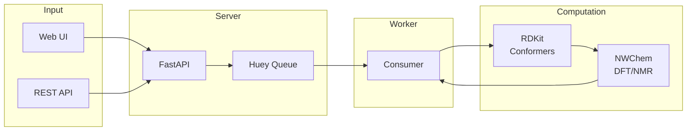

<objective>
Create the documentation foundation for qm-nmr-calc by restructuring README.md and establishing the docs/ directory structure.

Purpose: Enable both academic researchers and developers to quickly understand what the project does, get started, and find detailed documentation. This phase establishes the structure that phases 26-31 will populate with detailed content.

Output: Restructured README.md (~150-200 lines) with value proposition, Mermaid architecture diagram, quick start, and documentation links. docs/ folder with index and placeholder files for all detailed documentation pages.
</objective>

<execution_context>
@/home/chris/.claude/get-shit-done/workflows/execute-plan.md
@/home/chris/.claude/get-shit-done/templates/summary.md
</execution_context>

<context>
@.planning/PROJECT.md
@.planning/ROADMAP.md
@.planning/STATE.md
@.planning/phases/25-readme-and-docs-structure/25-RESEARCH.md
@README.md
</context>

<tasks>

<task type="auto">
  <name>Task 1: Create docs/ directory structure with index and placeholders</name>
  <files>
    docs/README.md
    docs/installation.md
    docs/usage.md
    docs/architecture.md
    docs/libraries.md
    docs/science.md
  </files>
  <action>
Create the docs/ directory and populate with index and placeholder files:

1. **docs/README.md** - Documentation index (~30-40 lines)
   - Title: "# Documentation"
   - Brief intro: "Comprehensive guides for qm-nmr-calc users and developers."
   - Three sections with links:
     - **For Users**: Installation Guide, Usage Guide
     - **For Developers**: Architecture, Libraries
     - **For Scientists**: NMR Methodology (DP4+, scaling, Boltzmann)
   - Each link should include 1-sentence description
   - Note at bottom: "Documentation is organized by audience and topic."

2. **docs/installation.md** - Placeholder (~15-20 lines)
   - Title: "# Installation Guide"
   - Note: "This guide will be completed in Phase 26."
   - Bullet list of topics to be covered:
     - System dependencies (NWChem, MPI, Python 3.11+)
     - uv package manager setup
     - Optional CREST/xTB for ensemble mode
     - Environment validation
     - Troubleshooting common issues
   - Link back to main README for current installation instructions

3. **docs/usage.md** - Placeholder (~15-20 lines)
   - Title: "# Usage Guide"
   - Note: "This guide will be completed in Phase 27."
   - Bullet list of topics to be covered:
     - Web UI workflow
     - REST API reference with curl examples
     - Single-conformer vs ensemble mode
     - Solvent selection
     - Calculation presets (draft/production)
     - Result interpretation (shifts, spectra, 3D viewer)
   - Link back to main README for current usage examples

4. **docs/architecture.md** - Placeholder (~15-20 lines)
   - Title: "# Technical Architecture"
   - Note: "This guide will be completed in Phase 28."
   - Bullet list of topics to be covered:
     - Full stack overview (FastAPI, Huey, NWChem, RDKit, 3Dmol.js)
     - Data flow diagrams
     - Job lifecycle states
     - File storage structure
     - Conformer ensemble pipeline
     - CSS architecture (layers, components, tokens)

5. **docs/libraries.md** - Placeholder (~15-20 lines)
   - Title: "# Library Documentation"
   - Note: "This guide will be completed in Phase 29."
   - Bullet list of topics to be covered:
     - RDKit (SMILES parsing, conformer generation, visualization)
     - NWChem (input generation, output parsing)
     - Huey (task queue, job tracking)
     - 3Dmol.js (molecule viewer, shift labels)
     - CREST/xTB (optional ensemble mode)
     - SmilesDrawer (molecule preview)

6. **docs/science.md** - Placeholder (~15-20 lines)
   - Title: "# NMR Methodology"
   - Note: "This guide will be completed in Phase 30."
   - Bullet list of topics to be covered:
     - NMR chemical shift prediction fundamentals
     - DFT theory (B3LYP, basis sets, GIAO)
     - COSMO solvation model
     - Linear scaling methodology
     - DELTA50 benchmark and scaling factor derivation
     - Boltzmann weighting for conformer ensembles
     - Expected accuracy and limitations
     - Literature references (ISiCLE, DELTA50, CREST, Grimblat)

**Format notes:**
- Use consistent heading structure (# for title, ## for sections)
- Keep placeholder files simple - just enough to avoid 404s and set expectations
- Each placeholder links back to README.md
  </action>
  <verify>
    - `ls docs/` shows all 6 files (README.md, installation.md, usage.md, architecture.md, libraries.md, science.md)
    - `grep -l "Phase 2" docs/*.md` returns 5 files (all except README.md)
    - `grep -c "installation.md" docs/README.md` returns at least 1
  </verify>
  <done>
    - docs/README.md exists as documentation index with links to all pages
    - All 5 placeholder files exist with topic outlines and "Coming in Phase N" notes
    - No orphaned links (README.md exists and all placeholders exist)
  </done>
</task>

<task type="auto">
  <name>Task 2: Restructure README.md with value proposition, Mermaid diagram, and quick start</name>
  <files>README.md</files>
  <action>
Rewrite README.md following pyOpenSci structure (~150-200 lines total):

**Section 1: Title and Badges** (~5 lines)
```markdown
# QM NMR Calculator


```

**Section 2: Accessible Introduction** (~10 lines)
Write a compelling 2-3 sentence description that:
- Explains what the project does in plain language (predict NMR spectra)
- States who it's for (chemists, researchers)
- Highlights key benefit (accurate predictions without running calculations manually)

Follow with a brief feature list (5-7 bullet points):
- Single or ensemble conformer predictions
- Boltzmann-weighted averaging
- Web UI and REST API
- Interactive 3D viewer with chemical shift labels
- Spectrum visualization
- Support for CHCl3, DMSO, and gas phase

**Section 3: Architecture Overview** (~30 lines including diagram)
Replace the ASCII diagram with a Mermaid flowchart:



Add 1-2 sentences explaining: FastAPI handles requests, Huey queues long-running DFT calculations, Worker uses RDKit for conformer generation and NWChem for quantum chemistry.

**Section 4: Quick Start** (~30 lines)
Provide minimal copy-paste path to running:

Prerequisites (one line: Linux, Python 3.11+, NWChem, uv)

```bash
# Clone and install
git clone https://github.com/steinbeck/qm-nmr-calc.git
cd qm-nmr-calc
uv sync

# Start services (two terminals)
uv run python scripts/run_consumer.py  # Terminal 1: Job processor
uv run python scripts/run_api.py       # Terminal 2: API server

# Open http://localhost:8000
```

Link to docs/installation.md for detailed setup including CREST/xTB.

**Section 5: Documentation** (~15 lines)
Link to all docs/ pages with brief descriptions:

- **[Installation Guide](docs/installation.md)** - System dependencies, uv setup, optional CREST
- **[Usage Guide](docs/usage.md)** - Web UI workflow and REST API reference
- **[Technical Architecture](docs/architecture.md)** - System design and data flow
- **[Library Documentation](docs/libraries.md)** - Third-party integrations
- **[NMR Methodology](docs/science.md)** - DP4+, linear scaling, and Boltzmann averaging

**Section 6: API Example** (~20 lines)
Keep a brief REST API example (submit job, check status, get results):

```bash
# Submit calculation
curl -X POST http://localhost:8000/api/v1/jobs \
  -H "Content-Type: application/json" \
  -d '{"smiles": "CCO", "solvent": "chcl3"}'

# Check status
curl http://localhost:8000/api/v1/jobs/{job_id}

# Get results
curl http://localhost:8000/api/v1/jobs/{job_id}/results
```

**Section 7: Development** (~15 lines)
- Running tests: `uv run pytest tests/ -v`
- Project structure: Brief 5-line tree showing key directories
- Link to docs/architecture.md for details

**Section 8: License and Acknowledgments** (~15 lines)
- MIT license
- Acknowledgments: NWChem, RDKit, ISiCLE influence
- Keep existing acknowledgments content

**What to remove/move:**
- Move detailed Prerequisites/Installation to docs/installation.md reference
- Move detailed Configuration section to docs/usage.md reference
- Move detailed Troubleshooting to docs/installation.md reference
- Move detailed Project Structure to docs/architecture.md reference
- Remove Known Limitations (covered in docs/science.md)
- Keep content concise - detail lives in docs/
  </action>
  <verify>
    - `wc -l README.md` returns 150-200 lines
    - `grep -c "mermaid" README.md` returns at least 1
    - `grep -c "docs/" README.md` returns at least 5
    - `grep "Quick Start" README.md` returns a match
  </verify>
  <done>
    - README.md is 150-200 lines with clear structure
    - Mermaid architecture diagram renders in GitHub preview
    - Quick Start section with copy-paste commands
    - Documentation section links to all 5 docs/ pages
    - Value proposition is clear in first paragraph
  </done>
</task>

</tasks>

<verification>
After both tasks complete:

1. **Link verification**: All docs/ links in README.md point to existing files
   ```bash
   grep -oP 'docs/[a-z]+\.md' README.md | while read f; do test -f "$f" && echo "OK: $f" || echo "MISSING: $f"; done
   ```

2. **Structure check**: docs/README.md links to all placeholder files
   ```bash
   for f in installation usage architecture libraries science; do
     grep -q "$f.md" docs/README.md && echo "OK: $f" || echo "MISSING: $f"
   done
   ```

3. **Mermaid test**: Preview README.md on GitHub or use Mermaid CLI to validate diagram syntax

4. **Line count**: README.md is between 150-200 lines
</verification>

<success_criteria>
Phase 25 requirements satisfied:

- [README-01] README.md opens with compelling value proposition explaining purpose
- [README-02] Mermaid architecture diagram shows system components and data flow
- [README-03] README.md links to all docs/ pages (installation, usage, architecture, libraries, science)
- [README-04] Quick Start section enables 5-minute path to running
- [STRUCT-01] docs/ directory created with logical organization (6 files)
- [STRUCT-02] All docs linked from both README.md and docs/README.md index
</success_criteria>

<output>
After completion, create `.planning/phases/25-readme-and-docs-structure/25-01-SUMMARY.md`
</output>
