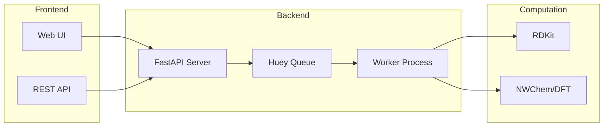

# Phase 25: README and Documentation Structure - Research

**Researched:** 2026-01-31
**Domain:** Documentation, Technical Writing, Markdown
**Confidence:** HIGH

## Summary

This phase establishes the documentation foundation for qm-nmr-calc by overhauling the README.md and creating the docs/ directory structure. The existing README is comprehensive (369 lines) but needs restructuring to prioritize accessibility, provide a compelling introduction, and link to detailed documentation that will be created in subsequent phases (26-31).

The standard approach for scientific Python projects involves: (1) a concise README with badges, accessible description, quick start, and navigation to detailed docs; (2) a docs/ folder with logically organized markdown files; and (3) Mermaid diagrams for architecture visualization directly in GitHub markdown.

**Primary recommendation:** Restructure README to lead with value proposition and quick start, move detailed content to docs/, and create a docs/ folder structure that anticipates phases 26-31.

## Standard Stack

### Core
| Tool | Version | Purpose | Why Standard |
|------|---------|---------|--------------|
| Markdown | GitHub Flavored | Documentation format | Native GitHub rendering, no build step required |
| Mermaid | GitHub-native | Architecture diagrams | Renders directly in GitHub README, version-controlled as text |

### Supporting
| Tool | Purpose | When to Use |
|------|---------|-------------|
| ASCII diagrams | Simple flow diagrams | When Mermaid is overkill or for code-block style diagrams |
| SVG images | Complex diagrams | When diagram complexity exceeds Mermaid capabilities |

### Alternatives Considered
| Instead of | Could Use | Tradeoff |
|------------|-----------|----------|
| Mermaid | PlantUML | PlantUML more powerful but requires external rendering |
| Mermaid | draw.io | More visual editing but binary format, harder to version |
| Plain markdown docs | MkDocs/Sphinx | Static site generators add build complexity, not needed for GitHub-only docs |

**No installation required:** Pure markdown documentation renders directly on GitHub.

## Architecture Patterns

### Recommended docs/ Structure
```
docs/
├── README.md              # Documentation index/navigation
├── installation.md        # Phase 26: System dependencies, uv, CREST/xTB
├── usage.md               # Phase 27: Web UI and REST API guide
├── architecture.md        # Phase 28: Technical system architecture
├── libraries.md           # Phase 29: Third-party library integrations
├── science.md             # Phase 30: DP4+/NMR methodology
└── images/                # Optional: screenshots, complex diagrams
    └── (created as needed)
```

### Pattern 1: Two-Tier Documentation
**What:** README provides overview and quick start; docs/ contains detailed guides
**When to use:** Projects with both casual users and developers/contributors
**Structure:**
- README.md: 100-200 lines, focused on value prop and getting started
- docs/: Detailed guides, each 200-500 lines covering specific topics

### Pattern 2: Accessible README Structure
**What:** Lead with value, follow pyOpenSci structure
**Sections in order:**
1. Package name + badges
2. 1-3 sentence accessible description
3. Quick start (copy-paste installation + first run)
4. Architecture overview (Mermaid diagram)
5. Links to detailed documentation
6. Contributing/Community
7. License/Acknowledgments

Source: [pyOpenSci README Best Practices](https://www.pyopensci.org/python-package-guide/documentation/repository-files/readme-file-best-practices.html)

### Pattern 3: Mermaid Architecture Diagram
**What:** Text-based diagrams that render in GitHub markdown
**Syntax:**
```markdown

```

**Benefits:**
- Version controlled as plain text
- Renders directly in GitHub (no external hosting)
- Easy to update as architecture evolves

Source: [GitHub Docs - Creating Diagrams](https://docs.github.com/en/get-started/writing-on-github/working-with-advanced-formatting/creating-diagrams)

### Pattern 4: docs/README.md as Index
**What:** Use README.md in docs/ folder as table of contents
**Why:** GitHub automatically displays README.md when viewing a directory
**Structure:**
```markdown
# Documentation

- [Installation Guide](installation.md) - System setup and dependencies
- [Usage Guide](usage.md) - Web UI and API reference
- [Architecture](architecture.md) - System design and data flow
...
```

### Anti-Patterns to Avoid
- **Monolithic README:** Everything in one file (current state); split into docs/
- **Sparse Quick Start:** User can't get running in 5 minutes; ensure copy-paste commands
- **Technical Jargon First:** Leading with implementation details; lead with value proposition
- **Broken Links:** Links to docs that don't exist yet; create placeholder files
- **Excessive Badges:** More than 5-6 badges clutters; keep to essential (build, version, license)

## Don't Hand-Roll

| Problem | Don't Build | Use Instead | Why |
|---------|-------------|-------------|-----|
| Diagrams | Custom SVGs | Mermaid | Version-controlled, renders in GitHub |
| Table of contents | Manual ToC | GitHub's automatic ToC (3+ headings) | Auto-updates, less maintenance |
| Static site | Jekyll/Sphinx | Plain markdown | Adds complexity, GitHub renders .md natively |
| Badge generation | Custom images | shields.io | Standard format, maintained |

**Key insight:** GitHub's native markdown rendering is sufficient for documentation that doesn't need search, versioning, or PDF export. Avoid static site generators until the need is proven.

## Common Pitfalls

### Pitfall 1: Orphaned Documentation Links
**What goes wrong:** README links to docs/ pages that don't exist yet
**Why it happens:** Creating structure before content; phases 26-31 create content
**How to avoid:** Create placeholder files with "Coming Soon" and link to them
**Warning signs:** 404s when clicking links, contributor confusion

### Pitfall 2: README That's Too Long
**What goes wrong:** Users scroll past important content; README becomes unmaintainable
**Why it happens:** Adding detail over time without pruning
**How to avoid:** Target 150-250 lines for README; move detail to docs/
**Warning signs:** README > 400 lines, tables of contents needed within README

### Pitfall 3: Inaccessible Language
**What goes wrong:** Non-expert users can't understand what project does
**Why it happens:** Developers write for themselves, not users
**How to avoid:** Write intro at high-school reading level; define jargon
**Warning signs:** First paragraph mentions "DFT," "GIAO," or "Huey" without explanation

Source: [pyOpenSci - Write for accessibility](https://www.pyopensci.org/python-package-guide/documentation/repository-files/readme-file-best-practices.html)

### Pitfall 4: Mermaid Rendering Issues
**What goes wrong:** Diagrams break or don't render
**Why it happens:** Using unsupported Mermaid features (hyperlinks, tooltips, emojis)
**How to avoid:** Test diagrams in GitHub preview; use simple flowchart syntax
**Warning signs:** Diagram shows as code block instead of visual

Source: [GitHub Mermaid limitations](https://docs.github.com/en/get-started/writing-on-github/working-with-advanced-formatting/creating-diagrams)

### Pitfall 5: Missing Dual-Audience Focus
**What goes wrong:** Documentation serves developers OR researchers, not both
**Why it happens:** Not explicitly addressing both audiences
**How to avoid:** Separate sections: Quick Start (users), Architecture (developers), Science (researchers)
**Warning signs:** Contributors can't find onboarding info; users can't find usage examples

## Code Examples

### README Introduction Pattern
```markdown
# QM NMR Calculator

Predict NMR chemical shifts for organic molecules using quantum chemistry.
Submit a molecule and get back 1H and 13C chemical shifts with interactive spectra.

<!-- Badges here -->

## Why QM NMR Calculator?

- **Accurate predictions** using DFT calculations with linear scaling
- **Conformer ensembles** with Boltzmann-weighted averaging
- **Simple web UI** for chemists - no command line required
- **REST API** for integration with automated workflows
```

### Mermaid Architecture Diagram
```markdown

```

### Quick Start Pattern
```markdown
## Quick Start

**Prerequisites:** Linux, Python 3.11+, NWChem

```bash
# Install
git clone https://github.com/steinbeck/qm-nmr-calc.git
cd qm-nmr-calc
uv sync

# Run (two terminals)
uv run python scripts/run_consumer.py  # Terminal 1
uv run python scripts/run_api.py       # Terminal 2

# Open http://localhost:8000
```

See [Installation Guide](docs/installation.md) for detailed setup including optional CREST.
```

### docs/ Index Pattern
```markdown
# Documentation

## For Users
- [Installation Guide](installation.md) - System requirements and setup
- [Usage Guide](usage.md) - Web interface and API reference

## For Developers
- [Architecture](architecture.md) - System design and data flow
- [Libraries](libraries.md) - Third-party integrations

## For Scientists
- [NMR Methodology](science.md) - DP4+, linear scaling, and Boltzmann averaging
```

## State of the Art

| Old Approach | Current Approach | When Changed | Impact |
|--------------|------------------|--------------|--------|
| PlantUML diagrams | Mermaid | 2022 (GitHub native support) | No external rendering needed |
| README-only docs | README + docs/ folder | Ongoing | Better organization for complex projects |
| Sphinx for all Python | Plain markdown for simple docs | Ongoing | Reduced complexity for GitHub-browsable docs |
| Static badges | shields.io dynamic badges | 2020s | Real-time status, standardized format |

**Current best practice:**
- GitHub-native Mermaid for diagrams (introduced Feb 2022)
- Plain markdown docs for projects that don't need search/PDF
- pyOpenSci structure for scientific Python packages

## Open Questions

1. **Badge Selection**
   - What we know: Common badges include build status, version, license
   - What's unclear: Whether to include coverage, Python versions, docs status
   - Recommendation: Start with 4-5 essential badges (license, Python version, build if CI exists, maybe DOI)

2. **Screenshot Inclusion**
   - What we know: Screenshots help users understand UI quickly
   - What's unclear: Whether to include in Phase 25 or defer to Phase 27 (Usage Guide)
   - Recommendation: Defer screenshots to Phase 27; Phase 25 focuses on structure

3. **Existing README Content**
   - What we know: Current README has comprehensive installation/usage sections
   - What's unclear: How much to keep vs. move to docs/
   - Recommendation: Keep minimal quick start in README; move detailed content to docs/installation.md and docs/usage.md placeholders

## Sources

### Primary (HIGH confidence)
- [pyOpenSci Python Package Guide - README Best Practices](https://www.pyopensci.org/python-package-guide/documentation/repository-files/readme-file-best-practices.html) - README structure, accessibility guidelines
- [GitHub Docs - Creating Diagrams](https://docs.github.com/en/get-started/writing-on-github/working-with-advanced-formatting/creating-diagrams) - Mermaid syntax, limitations
- [MkDocs - Writing Your Docs](https://www.mkdocs.org/user-guide/writing-your-docs/) - File layout conventions (applicable to plain markdown too)

### Secondary (MEDIUM confidence)
- [matklad - ARCHITECTURE.md](https://matklad.github.io/2021/02/06/ARCHITECTURE.md.html) - Architecture documentation patterns
- [Real Python - README Best Practices](https://realpython.com/readme-python-project/) - Python-specific README guidance
- [The Hitchhiker's Guide to Python - Structuring Your Project](https://docs.python-guide.org/writing/structure/) - Project layout conventions

### Tertiary (LOW confidence)
- WebSearch: General documentation structure patterns - Community consensus, needs validation per-project

## Metadata

**Confidence breakdown:**
- Standard stack: HIGH - GitHub markdown and Mermaid are well-documented, stable
- Architecture patterns: HIGH - pyOpenSci and MkDocs conventions are established
- Pitfalls: MEDIUM - Based on multiple sources but specific to this project's context

**Research date:** 2026-01-31
**Valid until:** 2026-04-30 (documentation patterns are stable)

---

## Phase 25 Specific Guidance

Based on this research, Phase 25 should:

1. **Restructure README.md** (~150-200 lines)
   - Add compelling introduction (value proposition, not technical details)
   - Replace ASCII architecture diagram with Mermaid flowchart
   - Add minimal Quick Start (5-minute path to running)
   - Add documentation links section pointing to docs/
   - Keep acknowledgments, license, contributing sections
   - Move detailed installation/usage to docs/ placeholders

2. **Create docs/ structure**
   ```
   docs/
   ├── README.md           # Index with links to all docs
   ├── installation.md     # Placeholder: "Coming in Phase 26"
   ├── usage.md            # Placeholder: "Coming in Phase 27"
   ├── architecture.md     # Placeholder: "Coming in Phase 28"
   ├── libraries.md        # Placeholder: "Coming in Phase 29"
   └── science.md          # Placeholder: "Coming in Phase 30"
   ```

3. **Requirements satisfied**
   - README-01: Compelling introduction with value proposition
   - README-02: Mermaid architecture diagram
   - README-03: Links to docs/ pages
   - README-04: Quick Start section
   - STRUCT-01: docs/ directory with logical organization
   - STRUCT-02: All docs linked from README
