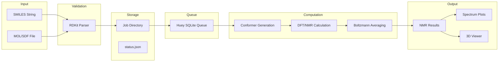
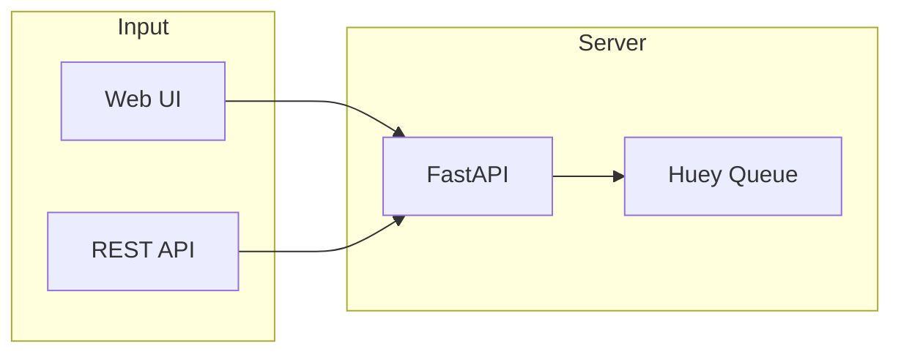
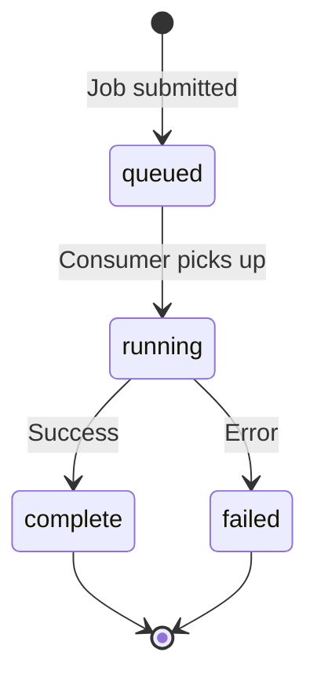
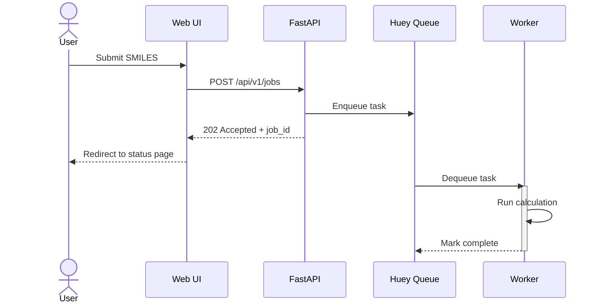

# Phase 28: Technical Architecture - Research

**Researched:** 2026-02-01
**Domain:** Technical Documentation / Architecture Documentation
**Confidence:** HIGH

## Summary

This phase focuses on creating developer-facing documentation of the QM NMR Calculator system architecture. The research analyzed the existing codebase structure (~6,000 LOC Python, ~2,400 LOC CSS) to understand how best to document the full stack (FastAPI, Huey, NWChem, RDKit, 3Dmol.js, CSS), data flows, job lifecycle states, file storage structure, conformer pipeline stages, and CSS architecture.

The codebase already has well-structured, modular code with clear separation of concerns. The existing `docs/architecture.md` file is a placeholder waiting for Phase 28 content. The documentation should leverage the existing README mermaid diagram style and extend it with detailed component views, state machines, and data flow diagrams.

The key insight is that this is primarily a **documentation extraction task** rather than research into new technologies. The architecture already exists in code - the task is to make it visible and understandable to developers and contributors.

**Primary recommendation:** Create hierarchical architecture documentation using Mermaid diagrams (already used in README) with clear separation between high-level overview, component views, data flows, state machines, and implementation details.

## Standard Stack

The established libraries/tools for technical architecture documentation:

### Core Documentation Tools
| Tool | Version | Purpose | Why Standard |
|------|---------|---------|--------------|
| Mermaid | 11.x | Diagrams in Markdown | Already used in README, GitHub native rendering |
| Markdown | - | Documentation format | Standard for code repos, works with GitHub |

### Diagram Types to Use
| Diagram Type | Mermaid Syntax | Use For |
|--------------|----------------|---------|
| Flowchart | `flowchart LR/TB` | Data flows, request pipelines |
| State Diagram | `stateDiagram-v2` | Job lifecycle states |
| Sequence | `sequenceDiagram` | Request/response flows |
| Block | `block-beta` | File directory layouts |
| Architecture | `architecture-beta` | System component views (v11+) |

### Alternatives Considered
| Instead of | Could Use | Tradeoff |
|------------|-----------|----------|
| Mermaid | PlantUML | PlantUML more powerful but less GitHub integration |
| Mermaid | Draw.io | Visual tool but harder to version control |
| Mermaid | C4 Model | More formal, better for large systems, overkill for this project |

## Architecture Patterns

### Recommended Documentation Structure

Based on the existing `docs/` directory and README:

```
docs/
├── README.md              # Index linking to all docs
├── architecture.md        # Phase 28 output - Technical Architecture
├── installation.md        # Already complete
├── usage.md               # Already complete
├── science.md             # Already exists
└── libraries.md           # Already exists
```

### Pattern 1: Hierarchical Zoom Levels

**What:** Document architecture at multiple abstraction levels (C4-inspired)
**When to use:** When audience ranges from newcomers to experienced contributors

**Levels for this project:**
1. **System Context** - Where QM NMR Calculator fits (already in README)
2. **Container View** - FastAPI, Huey, NWChem, RDKit, 3Dmol.js
3. **Component View** - Modules within each container
4. **Code View** - Key function signatures and data models (selective)

### Pattern 2: Data Flow Documentation

**What:** Show how data transforms from input to output
**When to use:** For understanding request lifecycle

**Example from codebase analysis:**


### Pattern 3: State Machine Documentation

**What:** Document job lifecycle with clear states and transitions
**When to use:** For any entity with defined state transitions

**Job states from codebase (models.py):**
- `queued` - Initial state after submission
- `running` - Task executing (set by signal handler)
- `complete` - Task finished successfully
- `failed` - Task failed with error

**Conformer states (models.py):**
- `pending` - Awaiting processing
- `optimizing` - DFT optimization running
- `optimized` - DFT complete, passed energy filter
- `nmr_running` - NMR calculation running
- `nmr_complete` - NMR complete, ready for averaging
- `failed` - Error occurred

### Anti-Patterns to Avoid

- **Documentation Drift:** Documenting implementation details that will change frequently
- **Duplicate Information:** Copying code into docs instead of referencing files
- **Abstract Descriptions Only:** Failing to provide concrete examples
- **Missing "Why":** Explaining "what" without explaining design decisions

## Don't Hand-Roll

Problems that look simple but have existing solutions:

| Problem | Don't Build | Use Instead | Why |
|---------|-------------|-------------|-----|
| Diagrams | Custom images | Mermaid in Markdown | Version-controlled, GitHub renders natively |
| Directory trees | ASCII art | Mermaid block diagrams | More maintainable, consistent style |
| State machines | Prose description | Mermaid stateDiagram | Visual is clearer than text |
| Sequence flows | Numbered lists | Mermaid sequenceDiagram | Shows concurrency and actors |

**Key insight:** The README already uses Mermaid - maintain consistency by using it throughout technical documentation.

## Common Pitfalls

### Pitfall 1: Over-Documentation
**What goes wrong:** Documenting every function, creating maintenance burden
**Why it happens:** Fear of missing something important
**How to avoid:** Focus on architecture (stable) not implementation (changes)
**Warning signs:** Documentation includes line numbers, exact function signatures for internal code

### Pitfall 2: Stale Diagrams
**What goes wrong:** Diagrams show outdated architecture after code changes
**Why it happens:** Diagrams are separate from code
**How to avoid:** Use text-based diagrams (Mermaid), keep diagrams high-level
**Warning signs:** Diagram mentions removed components or missing new ones

### Pitfall 3: Single Audience
**What goes wrong:** Documentation only useful for one type of reader
**Why it happens:** Author knows the system too well
**How to avoid:** Include both overview (newcomers) and details (contributors)
**Warning signs:** No quick-start, or only quick-start with no depth

### Pitfall 4: Missing Visual Consistency
**What goes wrong:** Different diagram styles, colors, naming conventions
**Why it happens:** Multiple authors, no style guide
**How to avoid:** Use consistent Mermaid themes, naming conventions
**Warning signs:** Some diagrams use subgraphs, others don't; mixed LR/TB orientations

## Code Examples

### Mermaid Flowchart (Data Flow)
```markdown

```

### Mermaid State Diagram (Job Lifecycle)
```markdown

```

### Mermaid Sequence Diagram (Request Flow)
```markdown

```

## Architecture Components to Document (From Codebase)

Based on code analysis, these are the key components to document:

### Full Stack Components
| Component | Location | Purpose |
|-----------|----------|---------|
| FastAPI App | `src/qm_nmr_calc/api/app.py` | HTTP server, routes |
| Huey Queue | `src/qm_nmr_calc/queue.py` | Task queue with SQLite backend |
| Tasks | `src/qm_nmr_calc/tasks.py` | NMR calculation orchestration |
| NWChem Runner | `src/qm_nmr_calc/nwchem/runner.py` | DFT/NMR execution via MPI |
| Storage | `src/qm_nmr_calc/storage.py` | Job directory and status management |
| Conformers | `src/qm_nmr_calc/conformers/` | Ensemble generation pipeline |
| Models | `src/qm_nmr_calc/models.py` | Pydantic data models |
| Visualization | `src/qm_nmr_calc/visualization.py` | Spectrum plots |

### CSS Architecture Components
| Layer | File | Purpose |
|-------|------|---------|
| Layer Declaration | `layers.css` | Cascade order: reset, base, layout, components, utilities |
| Design Tokens | `tokens.css` | Custom properties: spacing, colors, typography, glass effects |
| Reset | `reset.css` | Browser normalization |
| Base | `base.css` | Element defaults |
| Layout | `layout.css` | Page structure, grids |
| Components | `components/glass-card.css` | Reusable UI components (BEM naming) |
| Pages | `pages/*.css` | Page-specific styles |
| Utilities | `utilities.css` | Single-purpose overrides |

### File Storage Structure (from storage.py)
```
data/jobs/{job_id}/
├── status.json                    # Job metadata and status
├── output/
│   ├── initial.xyz                # RDKit 3D geometry
│   ├── optimized.xyz              # DFT-optimized geometry
│   ├── nmr_results.json           # Chemical shifts
│   ├── spectrum_1H.svg/png        # 1H spectrum plot
│   ├── spectrum_13C.svg/png       # 13C spectrum plot
│   ├── structure_annotated.svg/png # 2D annotated structure
│   ├── conformers/{conf_id}/      # Per-conformer outputs
│   │   └── geometry.xyz / optimized.xyz
│   └── optimized/                 # Optimized conformer geometries
├── scratch/
│   ├── optimize.nw / optimize.out # NWChem optimization files
│   ├── shielding.nw / shielding.out # NMR calculation files
│   └── conformers/{conf_id}/      # Per-conformer scratch
└── logs/                          # NWChem logs
```

### Conformer Pipeline Stages (from pipeline.py, tasks.py)
1. **Conformer Generation** - RDKit KDG or CREST
2. **MMFF Optimization** - Force field pre-optimization (RDKit only)
3. **RMSD Deduplication** - Remove structurally similar conformers
4. **Energy Window Filter** - Pre-DFT filter (6 kcal/mol default)
5. **Diversity Clustering** - Select representative conformers
6. **DFT Optimization** - NWChem geometry optimization
7. **Post-DFT Energy Filter** - 3 kcal/mol window
8. **NMR Calculation** - NWChem shielding computation
9. **Boltzmann Averaging** - Population-weighted shift averaging

## State of the Art

| Old Approach | Current Approach | When Changed | Impact |
|--------------|------------------|--------------|--------|
| Draw.io/Visio diagrams | Mermaid in Markdown | 2020+ | Diagrams version-controlled with code |
| Separate wiki | In-repo docs/ folder | DevOps movement | Single source of truth |
| Comprehensive UML | Selective diagrams | Agile adoption | Focus on value, not completeness |
| Architecture as afterthought | ADRs and living docs | 2015+ | Architecture decisions tracked |

**Current best practice:** Documentation lives with code in `docs/` folder, uses text-based diagrams (Mermaid), focuses on architecture decisions and data flows rather than implementation details.

## Open Questions

1. **Diagram depth for CSS section**
   - What we know: CSS uses cascade layers (5 layers), design tokens, BEM components
   - What's unclear: How much detail is useful for developers vs. overwhelming
   - Recommendation: Show layer hierarchy diagram, list tokens categories, reference component files

2. **Code examples in architecture doc**
   - What we know: Some concrete examples help understanding
   - What's unclear: How many code snippets before it becomes a tutorial
   - Recommendation: Include key data structures (JobStatus, NMRResults) as reference

## Sources

### Primary (HIGH confidence)
- Codebase analysis: `src/qm_nmr_calc/` - all major modules read and analyzed
- Existing documentation: `README.md`, `docs/` - current patterns observed
- CSS architecture: `src/qm_nmr_calc/api/static/css/` - all CSS files analyzed

### Secondary (MEDIUM confidence)
- [Mermaid Official Documentation](https://mermaid.js.org/) - diagram syntax reference
- [GitHub Mermaid Support](https://github.blog/developer-skills/github/include-diagrams-markdown-files-mermaid/) - rendering confirmation
- [Software Architecture Documentation Guide](https://www.workingsoftware.dev/software-architecture-documentation-the-ultimate-guide/) - best practices
- [C4 Model](https://c4model.com/) - hierarchical diagram inspiration

### Tertiary (LOW confidence)
- WebSearch results for documentation patterns - general guidance only

## Metadata

**Confidence breakdown:**
- Standard stack: HIGH - Mermaid already used in project, patterns well-established
- Architecture patterns: HIGH - Based on actual codebase analysis
- CSS documentation: HIGH - All CSS files analyzed, clear layer structure
- Pitfalls: MEDIUM - Based on industry experience and web research

**Research date:** 2026-02-01
**Valid until:** 2026-03-01 (30 days - stable domain, patterns won't change)
