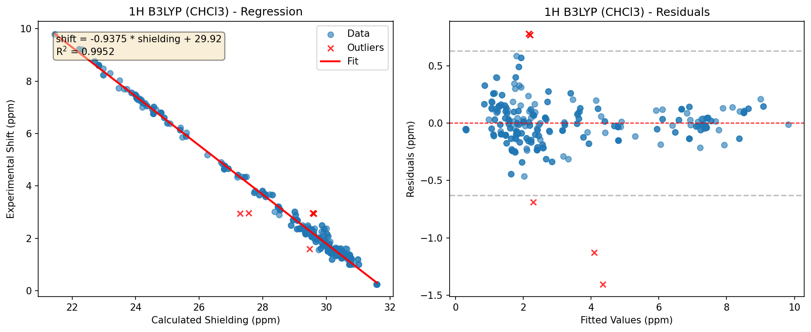
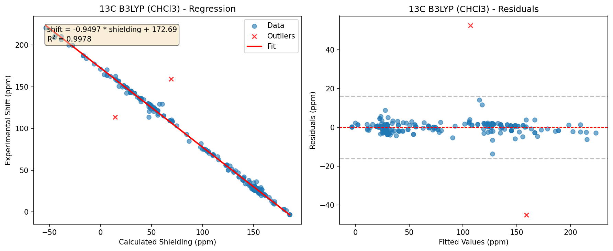
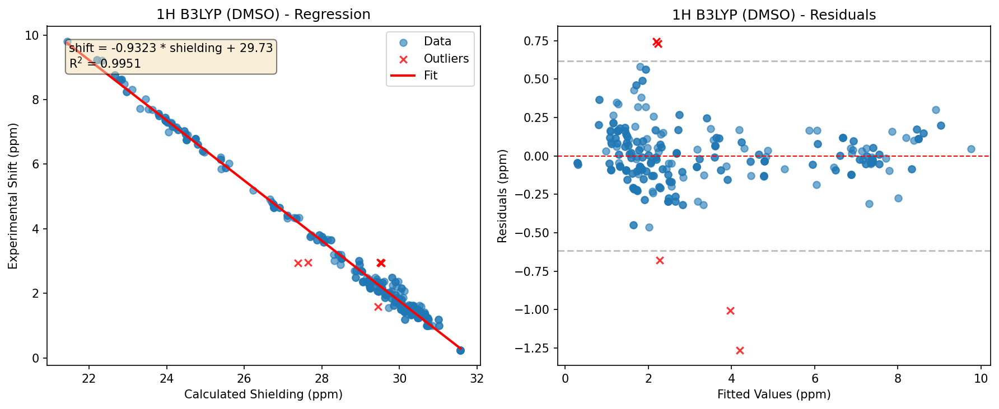
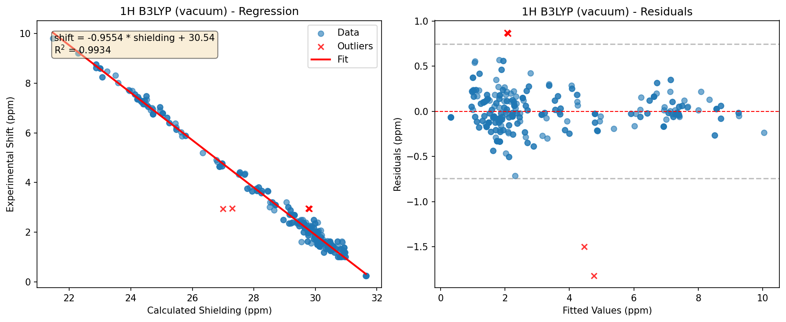
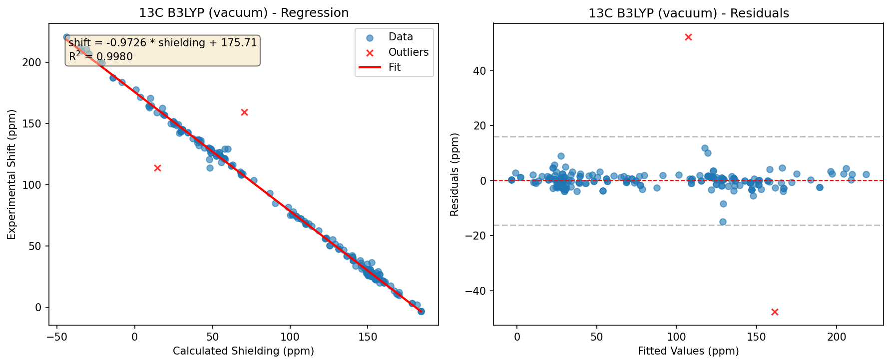
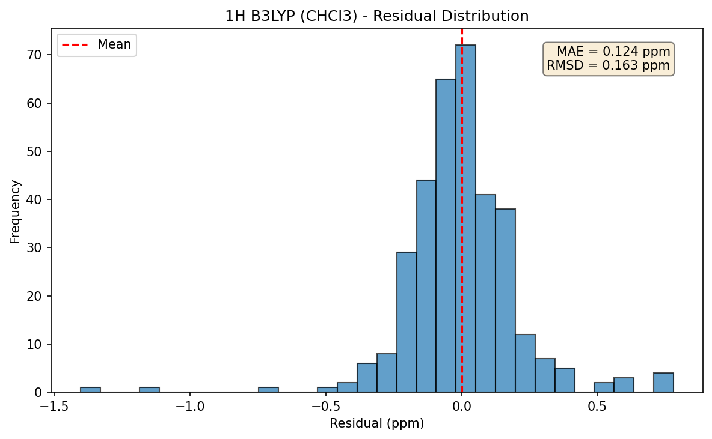
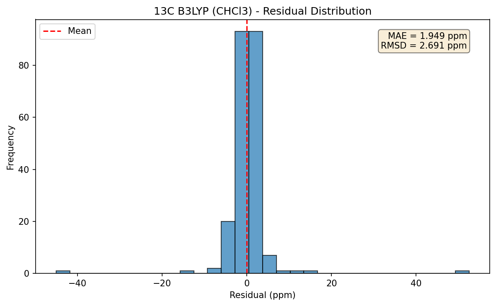
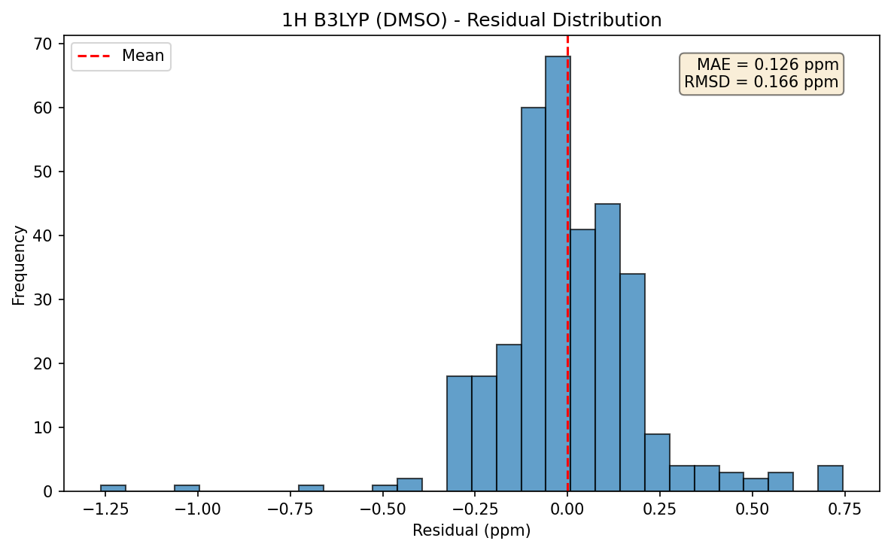
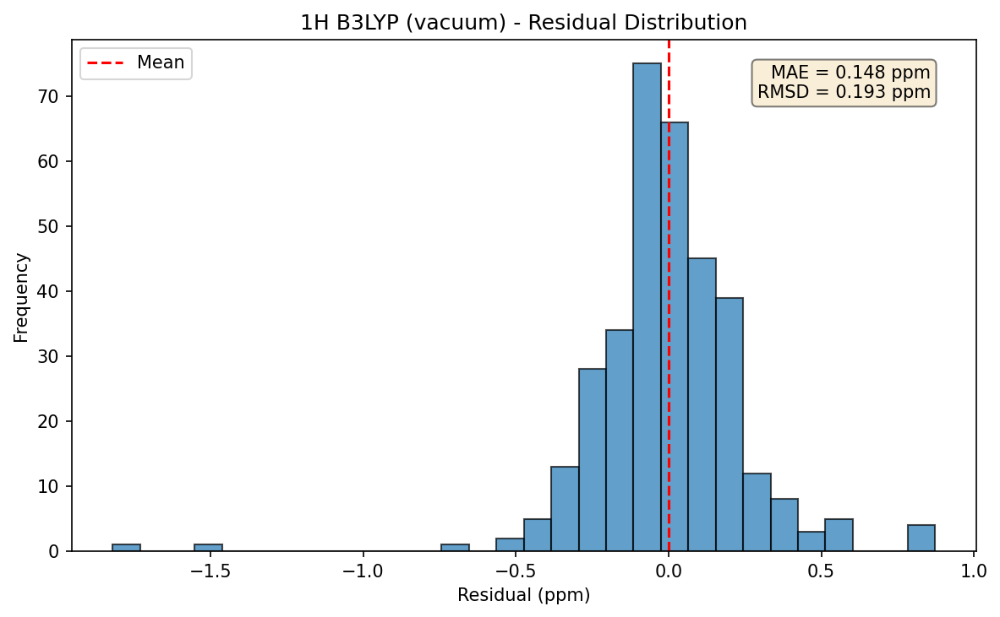
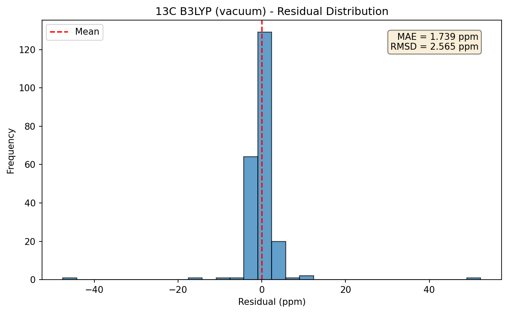

# DELTA50 NMR Scaling Factors

Derived from DELTA50 benchmark data using B3LYP/6-311+G(2d,p) calculations.

## Methodology

Scaling factors convert calculated NMR shielding values (sigma) to predicted
chemical shifts (delta) using linear regression:

```
delta = slope * sigma + intercept
```

**Fitting procedure:**
1. Aggregate shielding-shift pairs across all DELTA50 compounds
2. Fit ordinary least squares (OLS) regression
3. Identify outliers with residuals > 3 standard deviations
4. Refit without outliers
5. Report final statistics with 95% confidence intervals

**Training data:** DELTA50 benchmark set (50 small organic molecules with
experimentally assigned NMR spectra in CDCl3).

## Scaling Factors

| Nucleus | Solvent | Slope | Intercept | R^2 | MAE (ppm) | RMSD (ppm) | n |
|---------|---------|-------|-----------|-----|-----------|------------|---|
| 13C | CHCl3 | -0.9497 (-0.9557, -0.9438) | 172.69 (172.02, 173.36) | 0.9978 | 1.949 | 2.691 | 219 |
| 13C | DMSO | -0.9429 (-0.9494, -0.9365) | 171.77 (171.05, 172.49) | 0.9974 | 2.152 | 2.916 | 219 |
| 13C | vacuum | -0.9726 (-0.9784, -0.9668) | 175.71 (175.06, 176.36) | 0.9980 | 1.739 | 2.567 | 219 |
| 1H | CHCl3 | -0.9375 (-0.9445, -0.9305) | 29.92 (29.72, 30.12) | 0.9952 | 0.124 | 0.163 | 335 |
| 1H | DMSO | -0.9323 (-0.9394, -0.9253) | 29.73 (29.53, 29.94) | 0.9951 | 0.126 | 0.166 | 335 |
| 1H | vacuum | -0.9554 (-0.9627, -0.9481) | 30.54 (30.33, 30.75) | 0.9934 | 0.148 | 0.195 | 336 |

*Values in parentheses are 95% confidence intervals.*

## Statistical Summary

### 1H B3LYP (CHCl3)

| Compound | Mean Error (ppm) | Max Error (ppm) | Atoms |
|----------|------------------|-----------------|-------|
| compound_17 | 0.496 | 1.403 | 9 |
| compound_10 | 0.494 | 1.130 | 7 |
| compound_07 | 0.288 | 0.398 | 6 |
| compound_30 | 0.271 | 0.586 | 11 |
| compound_15 | 0.234 | 0.396 | 9 |
| compound_40 | 0.218 | 0.491 | 13 |
| compound_37 | 0.194 | 0.243 | 12 |
| compound_03 | 0.189 | 0.327 | 4 |
| compound_27 | 0.183 | 0.689 | 10 |
| compound_28 | 0.169 | 0.442 | 12 |
| compound_26 | 0.168 | 0.252 | 10 |
| compound_22 | 0.167 | 0.236 | 4 |
| compound_32 | 0.156 | 0.260 | 9 |
| compound_09 | 0.154 | 0.302 | 6 |
| compound_49 | 0.143 | 0.143 | 2 |
| compound_29 | 0.131 | 0.260 | 10 |
| compound_20 | 0.126 | 0.175 | 7 |
| compound_23 | 0.126 | 0.212 | 4 |
| compound_38 | 0.125 | 0.188 | 10 |
| compound_41 | 0.125 | 0.237 | 10 |
| compound_45 | 0.122 | 0.122 | 4 |
| compound_50 | 0.118 | 0.152 | 6 |
| compound_01 | 0.112 | 0.126 | 3 |
| compound_47 | 0.108 | 0.156 | 8 |
| compound_02 | 0.100 | 0.399 | 5 |
| compound_33 | 0.096 | 0.190 | 6 |
| compound_19 | 0.096 | 0.200 | 6 |
| compound_25 | 0.096 | 0.145 | 4 |
| compound_16 | 0.095 | 0.179 | 8 |
| compound_36 | 0.093 | 0.186 | 12 |
| compound_14 | 0.091 | 0.091 | 6 |
| compound_24 | 0.090 | 0.090 | 4 |
| compound_12 | 0.087 | 0.138 | 3 |
| compound_42 | 0.086 | 0.216 | 8 |
| compound_13 | 0.083 | 0.167 | 8 |
| compound_44 | 0.074 | 0.133 | 5 |
| compound_48 | 0.069 | 0.130 | 8 |
| compound_31 | 0.066 | 0.129 | 8 |
| compound_46 | 0.065 | 0.218 | 8 |
| compound_21 | 0.062 | 0.079 | 4 |
| compound_06 | 0.054 | 0.059 | 6 |
| compound_34 | 0.052 | 0.081 | 7 |
| compound_35 | 0.049 | 0.107 | 5 |
| compound_18 | 0.047 | 0.062 | 6 |
| compound_04 | 0.046 | 0.046 | 4 |
| compound_11 | 0.046 | 0.091 | 5 |
| compound_08 | 0.033 | 0.034 | 6 |
| compound_39 | 0.032 | 0.039 | 6 |
| compound_43 | 0.031 | 0.038 | 5 |
| compound_05 | 0.011 | 0.014 | 3 |

**Note:** Compounds with mean error > 2x MAE (0.248 ppm):
compound_17, compound_10, compound_07, compound_30

### 13C B3LYP (CHCl3)

| Compound | Mean Error (ppm) | Max Error (ppm) | Atoms |
|----------|------------------|-----------------|-------|
| compound_48 | 20.939 | 52.512 | 7 |
| compound_10 | 5.006 | 8.745 | 3 |
| compound_17 | 3.070 | 5.031 | 4 |
| compound_28 | 2.958 | 4.598 | 5 |
| compound_36 | 2.775 | 5.718 | 6 |
| compound_13 | 2.748 | 5.938 | 4 |
| compound_05 | 2.610 | 2.985 | 2 |
| compound_33 | 2.562 | 4.678 | 5 |
| compound_41 | 2.502 | 3.469 | 6 |
| compound_42 | 2.468 | 4.812 | 6 |
| compound_15 | 2.357 | 5.270 | 4 |
| compound_18 | 2.336 | 6.124 | 4 |
| compound_47 | 2.292 | 3.512 | 7 |
| compound_26 | 2.277 | 3.709 | 5 |
| compound_34 | 2.245 | 2.369 | 5 |
| compound_31 | 2.244 | 2.885 | 5 |
| compound_32 | 2.043 | 3.964 | 5 |
| compound_40 | 1.921 | 2.476 | 6 |
| compound_38 | 1.900 | 3.455 | 6 |
| compound_22 | 1.815 | 2.656 | 4 |
| compound_39 | 1.781 | 1.889 | 6 |
| compound_03 | 1.741 | 2.204 | 2 |
| compound_46 | 1.708 | 2.274 | 7 |
| compound_20 | 1.629 | 3.343 | 4 |
| compound_19 | 1.537 | 2.828 | 4 |
| compound_07 | 1.525 | 2.360 | 3 |
| compound_37 | 1.504 | 1.520 | 6 |
| compound_11 | 1.490 | 2.475 | 3 |
| compound_43 | 1.477 | 1.715 | 6 |
| compound_45 | 1.447 | 1.559 | 6 |
| compound_02 | 1.429 | 1.596 | 2 |
| compound_29 | 1.415 | 1.913 | 5 |
| compound_35 | 1.390 | 1.709 | 5 |
| compound_49 | 1.371 | 2.712 | 4 |
| compound_16 | 1.362 | 2.617 | 4 |
| compound_21 | 1.305 | 1.414 | 4 |
| compound_04 | 1.223 | 1.223 | 2 |
| compound_25 | 1.222 | 1.672 | 4 |
| compound_30 | 1.158 | 3.092 | 5 |
| compound_27 | 1.102 | 2.833 | 5 |
| compound_09 | 1.004 | 1.316 | 3 |
| compound_23 | 0.993 | 1.587 | 4 |
| compound_44 | 0.991 | 1.910 | 6 |
| compound_24 | 0.853 | 0.853 | 4 |
| compound_12 | 0.769 | 1.812 | 3 |
| compound_14 | 0.697 | 1.326 | 4 |
| compound_50 | 0.545 | 1.017 | 4 |
| compound_01 | 0.354 | 0.354 | 1 |
| compound_06 | 0.215 | 0.252 | 3 |
| compound_08 | 0.172 | 0.176 | 3 |

**Note:** Compounds with mean error > 2x MAE (3.898 ppm):
compound_48, compound_10

### 1H B3LYP (DMSO)

| Compound | Mean Error (ppm) | Max Error (ppm) | Atoms |
|----------|------------------|-----------------|-------|
| compound_17 | 0.495 | 1.263 | 9 |
| compound_10 | 0.466 | 1.005 | 7 |
| compound_07 | 0.352 | 0.460 | 6 |
| compound_30 | 0.268 | 0.581 | 11 |
| compound_03 | 0.243 | 0.381 | 4 |
| compound_22 | 0.228 | 0.265 | 4 |
| compound_40 | 0.219 | 0.490 | 13 |
| compound_15 | 0.193 | 0.338 | 9 |
| compound_37 | 0.188 | 0.217 | 12 |
| compound_28 | 0.183 | 0.449 | 12 |
| compound_27 | 0.177 | 0.677 | 10 |
| compound_09 | 0.172 | 0.318 | 6 |
| compound_26 | 0.161 | 0.228 | 10 |
| compound_23 | 0.154 | 0.299 | 4 |
| compound_41 | 0.146 | 0.244 | 10 |
| compound_32 | 0.134 | 0.215 | 9 |
| compound_33 | 0.127 | 0.276 | 6 |
| compound_42 | 0.125 | 0.310 | 8 |
| compound_25 | 0.125 | 0.197 | 4 |
| compound_20 | 0.121 | 0.155 | 7 |
| compound_45 | 0.118 | 0.118 | 4 |
| compound_02 | 0.111 | 0.350 | 5 |
| compound_24 | 0.111 | 0.111 | 4 |
| compound_29 | 0.111 | 0.247 | 10 |
| compound_50 | 0.106 | 0.132 | 6 |
| compound_01 | 0.102 | 0.130 | 3 |
| compound_12 | 0.098 | 0.119 | 3 |
| compound_38 | 0.098 | 0.167 | 10 |
| compound_16 | 0.096 | 0.155 | 8 |
| compound_49 | 0.096 | 0.096 | 2 |
| compound_47 | 0.094 | 0.128 | 8 |
| compound_36 | 0.094 | 0.203 | 12 |
| compound_35 | 0.090 | 0.172 | 5 |
| compound_14 | 0.087 | 0.087 | 6 |
| compound_19 | 0.084 | 0.171 | 6 |
| compound_13 | 0.075 | 0.150 | 8 |
| compound_21 | 0.073 | 0.094 | 4 |
| compound_31 | 0.064 | 0.127 | 8 |
| compound_11 | 0.063 | 0.120 | 5 |
| compound_48 | 0.063 | 0.116 | 8 |
| compound_46 | 0.062 | 0.198 | 8 |
| compound_44 | 0.056 | 0.096 | 5 |
| compound_34 | 0.055 | 0.103 | 7 |
| compound_06 | 0.048 | 0.055 | 6 |
| compound_18 | 0.048 | 0.069 | 6 |
| compound_05 | 0.046 | 0.050 | 3 |
| compound_43 | 0.031 | 0.042 | 5 |
| compound_08 | 0.030 | 0.034 | 6 |
| compound_39 | 0.025 | 0.033 | 6 |
| compound_04 | 0.017 | 0.017 | 4 |

**Note:** Compounds with mean error > 2x MAE (0.253 ppm):
compound_17, compound_10, compound_07, compound_30

### 13C B3LYP (DMSO)

| Compound | Mean Error (ppm) | Max Error (ppm) | Atoms |
|----------|------------------|-----------------|-------|
| compound_48 | 20.858 | 52.561 | 7 |
| compound_10 | 5.021 | 8.686 | 3 |
| compound_05 | 3.234 | 4.467 | 2 |
| compound_33 | 3.148 | 6.201 | 5 |
| compound_17 | 3.126 | 5.045 | 4 |
| compound_13 | 3.019 | 6.067 | 4 |
| compound_18 | 2.973 | 8.028 | 4 |
| compound_42 | 2.962 | 6.584 | 6 |
| compound_28 | 2.951 | 4.580 | 5 |
| compound_36 | 2.904 | 5.709 | 6 |
| compound_41 | 2.901 | 4.021 | 6 |
| compound_31 | 2.773 | 4.403 | 5 |
| compound_34 | 2.686 | 3.406 | 5 |
| compound_15 | 2.657 | 6.081 | 4 |
| compound_03 | 2.629 | 3.599 | 2 |
| compound_22 | 2.416 | 2.895 | 4 |
| compound_32 | 2.359 | 4.311 | 5 |
| compound_26 | 2.265 | 3.689 | 5 |
| compound_39 | 2.258 | 2.392 | 6 |
| compound_40 | 2.067 | 2.646 | 6 |
| compound_46 | 2.054 | 2.899 | 7 |
| compound_11 | 1.973 | 3.699 | 3 |
| compound_38 | 1.956 | 3.554 | 6 |
| compound_20 | 1.954 | 3.537 | 4 |
| compound_47 | 1.947 | 3.481 | 7 |
| compound_19 | 1.863 | 3.020 | 4 |
| compound_43 | 1.712 | 2.073 | 6 |
| compound_35 | 1.701 | 1.939 | 5 |
| compound_07 | 1.701 | 3.801 | 3 |
| compound_21 | 1.689 | 1.919 | 4 |
| compound_02 | 1.668 | 1.938 | 2 |
| compound_29 | 1.508 | 1.975 | 5 |
| compound_37 | 1.495 | 1.515 | 6 |
| compound_45 | 1.478 | 1.576 | 6 |
| compound_23 | 1.398 | 1.488 | 4 |
| compound_44 | 1.395 | 2.090 | 6 |
| compound_24 | 1.331 | 1.331 | 4 |
| compound_49 | 1.327 | 2.640 | 4 |
| compound_16 | 1.318 | 2.617 | 4 |
| compound_30 | 1.275 | 3.230 | 5 |
| compound_04 | 1.077 | 1.077 | 2 |
| compound_01 | 1.021 | 1.021 | 1 |
| compound_25 | 0.959 | 0.975 | 4 |
| compound_09 | 0.948 | 1.502 | 3 |
| compound_27 | 0.907 | 2.592 | 5 |
| compound_12 | 0.741 | 1.629 | 3 |
| compound_14 | 0.707 | 1.302 | 4 |
| compound_50 | 0.651 | 0.828 | 4 |
| compound_06 | 0.147 | 0.194 | 3 |
| compound_08 | 0.015 | 0.018 | 3 |

**Note:** Compounds with mean error > 2x MAE (4.304 ppm):
compound_48, compound_10

### 1H B3LYP (vacuum)

| Compound | Mean Error (ppm) | Max Error (ppm) | Atoms |
|----------|------------------|-----------------|-------|
| compound_10 | 0.567 | 1.502 | 7 |
| compound_17 | 0.509 | 1.820 | 9 |
| compound_15 | 0.358 | 0.555 | 9 |
| compound_49 | 0.314 | 0.314 | 2 |
| compound_30 | 0.298 | 0.568 | 11 |
| compound_40 | 0.217 | 0.461 | 13 |
| compound_27 | 0.213 | 0.716 | 10 |
| compound_37 | 0.213 | 0.327 | 12 |
| compound_32 | 0.208 | 0.373 | 9 |
| compound_02 | 0.204 | 0.538 | 5 |
| compound_38 | 0.204 | 0.348 | 10 |
| compound_26 | 0.201 | 0.332 | 10 |
| compound_01 | 0.191 | 0.252 | 3 |
| compound_22 | 0.188 | 0.424 | 4 |
| compound_19 | 0.185 | 0.286 | 6 |
| compound_25 | 0.183 | 0.349 | 4 |
| compound_29 | 0.182 | 0.287 | 10 |
| compound_28 | 0.181 | 0.436 | 12 |
| compound_05 | 0.180 | 0.180 | 3 |
| compound_20 | 0.175 | 0.238 | 7 |
| compound_12 | 0.167 | 0.217 | 3 |
| compound_45 | 0.164 | 0.165 | 4 |
| compound_47 | 0.152 | 0.255 | 8 |
| compound_04 | 0.152 | 0.152 | 4 |
| compound_50 | 0.150 | 0.214 | 6 |
| compound_44 | 0.140 | 0.266 | 5 |
| compound_09 | 0.128 | 0.302 | 6 |
| compound_13 | 0.122 | 0.207 | 8 |
| compound_07 | 0.116 | 0.236 | 6 |
| compound_03 | 0.113 | 0.237 | 4 |
| compound_31 | 0.112 | 0.153 | 8 |
| compound_41 | 0.106 | 0.240 | 10 |
| compound_11 | 0.105 | 0.170 | 5 |
| compound_14 | 0.101 | 0.101 | 6 |
| compound_48 | 0.100 | 0.200 | 8 |
| compound_35 | 0.099 | 0.119 | 5 |
| compound_23 | 0.097 | 0.217 | 4 |
| compound_36 | 0.096 | 0.177 | 12 |
| compound_16 | 0.090 | 0.246 | 8 |
| compound_34 | 0.087 | 0.122 | 7 |
| compound_46 | 0.080 | 0.285 | 8 |
| compound_06 | 0.063 | 0.064 | 6 |
| compound_33 | 0.051 | 0.106 | 6 |
| compound_42 | 0.043 | 0.107 | 8 |
| compound_39 | 0.039 | 0.060 | 6 |
| compound_18 | 0.039 | 0.041 | 6 |
| compound_08 | 0.039 | 0.063 | 6 |
| compound_21 | 0.035 | 0.052 | 4 |
| compound_24 | 0.030 | 0.030 | 4 |
| compound_43 | 0.012 | 0.016 | 5 |

**Note:** Compounds with mean error > 2x MAE (0.296 ppm):
compound_10, compound_17, compound_15, compound_49, compound_30

### 13C B3LYP (vacuum)

| Compound | Mean Error (ppm) | Max Error (ppm) | Atoms |
|----------|------------------|-----------------|-------|
| compound_48 | 21.205 | 52.277 | 7 |
| compound_10 | 5.120 | 8.956 | 3 |
| compound_17 | 3.586 | 5.019 | 4 |
| compound_47 | 3.370 | 3.565 | 7 |
| compound_28 | 2.961 | 4.618 | 5 |
| compound_07 | 2.495 | 2.496 | 3 |
| compound_05 | 2.466 | 2.886 | 2 |
| compound_26 | 2.320 | 3.783 | 5 |
| compound_36 | 2.300 | 5.707 | 6 |
| compound_41 | 2.026 | 3.003 | 6 |
| compound_25 | 1.883 | 3.660 | 4 |
| compound_42 | 1.860 | 3.449 | 6 |
| compound_01 | 1.856 | 1.856 | 1 |
| compound_13 | 1.801 | 5.393 | 4 |
| compound_38 | 1.727 | 3.069 | 6 |
| compound_33 | 1.726 | 4.594 | 5 |
| compound_50 | 1.724 | 1.817 | 4 |
| compound_27 | 1.718 | 3.604 | 5 |
| compound_19 | 1.702 | 2.564 | 4 |
| compound_04 | 1.636 | 1.636 | 2 |
| compound_16 | 1.621 | 2.677 | 4 |
| compound_02 | 1.573 | 2.186 | 2 |
| compound_37 | 1.539 | 1.539 | 6 |
| compound_15 | 1.535 | 3.332 | 4 |
| compound_34 | 1.528 | 2.199 | 5 |
| compound_35 | 1.506 | 1.687 | 5 |
| compound_40 | 1.457 | 1.869 | 6 |
| compound_31 | 1.456 | 2.351 | 5 |
| compound_32 | 1.432 | 2.801 | 5 |
| compound_49 | 1.407 | 2.787 | 4 |
| compound_03 | 1.407 | 2.611 | 2 |
| compound_45 | 1.383 | 2.292 | 6 |
| compound_20 | 1.181 | 2.743 | 4 |
| compound_09 | 1.131 | 1.673 | 3 |
| compound_29 | 1.108 | 1.922 | 5 |
| compound_12 | 1.085 | 2.214 | 3 |
| compound_23 | 1.071 | 2.627 | 4 |
| compound_22 | 1.057 | 2.062 | 4 |
| compound_11 | 1.036 | 1.658 | 3 |
| compound_30 | 0.997 | 2.600 | 5 |
| compound_44 | 0.986 | 1.253 | 6 |
| compound_43 | 0.958 | 3.779 | 6 |
| compound_08 | 0.742 | 0.750 | 3 |
| compound_14 | 0.673 | 1.318 | 4 |
| compound_24 | 0.662 | 0.662 | 4 |
| compound_46 | 0.584 | 1.569 | 7 |
| compound_18 | 0.383 | 0.642 | 4 |
| compound_06 | 0.321 | 0.323 | 3 |
| compound_39 | 0.276 | 0.418 | 6 |
| compound_21 | 0.157 | 0.285 | 4 |

**Note:** Compounds with mean error > 2x MAE (3.478 ppm):
compound_48, compound_10, compound_17

## Plots

### Regression Analysis












### Residual Distributions












## Usage

Apply scaling factors to convert calculated shielding to predicted shift:

```python
from qm_nmr_calc.benchmark.analysis import derive_all_factors, get_factor_key

# Get all factors
factors = derive_all_factors()

# Look up specific factor
key = get_factor_key('B3LYP', '6-311+G(2d,p)', '1H', 'CHCl3')
factor = factors[key]

# Convert shielding to shift
shielding = 30.5  # ppm (calculated)
shift = factor.slope * shielding + factor.intercept
print(f'Predicted shift: {shift:.2f} ppm')
```

Or load from JSON:

```python
import json

with open('scaling_factors.json') as f:
    factors = json.load(f)

factor = factors['B3LYP/6-311+G(2d,p)/1H/CHCl3']
shift = factor['slope'] * shielding + factor['intercept']
```

## Notes

- **WP04 factors:** Not yet available (benchmark calculations incomplete)
- **DMSO solvent:** Uses same experimental data as CHCl3 (from DELTA50 paper)
  with COSMO solvent model applied during calculation
- **Vacuum (gas-phase):** Uses same experimental data as CHCl3 with no COSMO
  solvent model (gas-phase DFT calculations). Slightly higher MAE than solvated,
  but still excellent R^2 > 0.99.
- **Outlier removal:** Applied 3-sigma threshold; number removed varies by factor set

---

*Generated by qm_nmr_calc.benchmark.analysis*