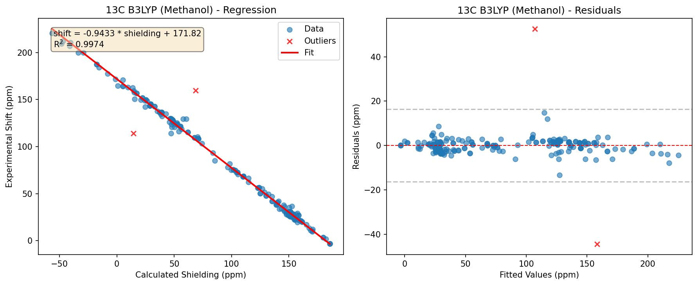
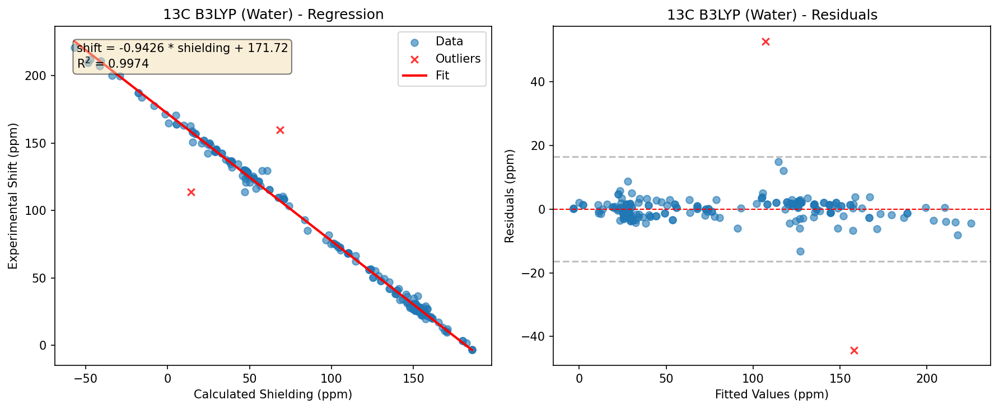
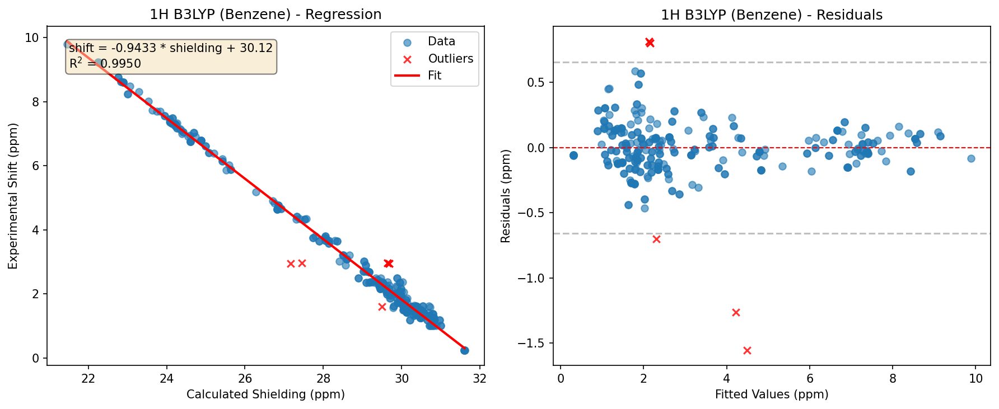
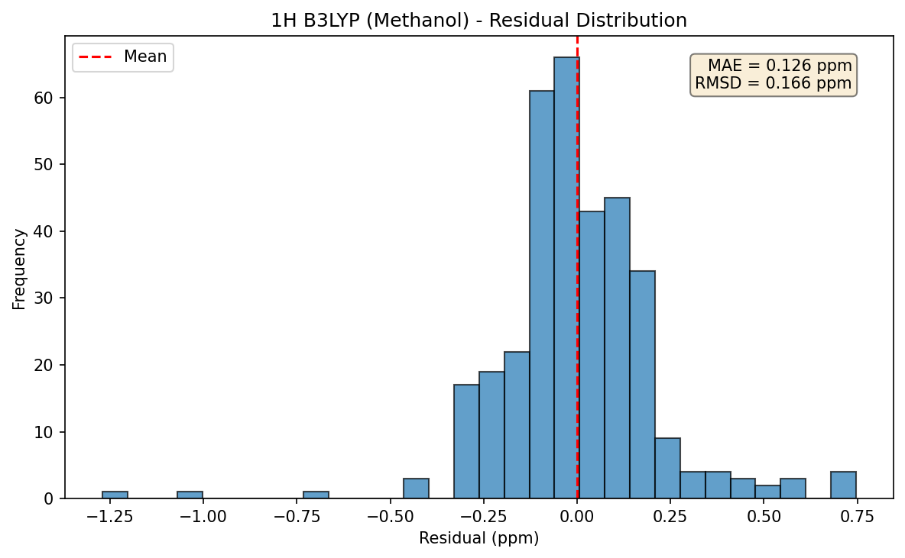
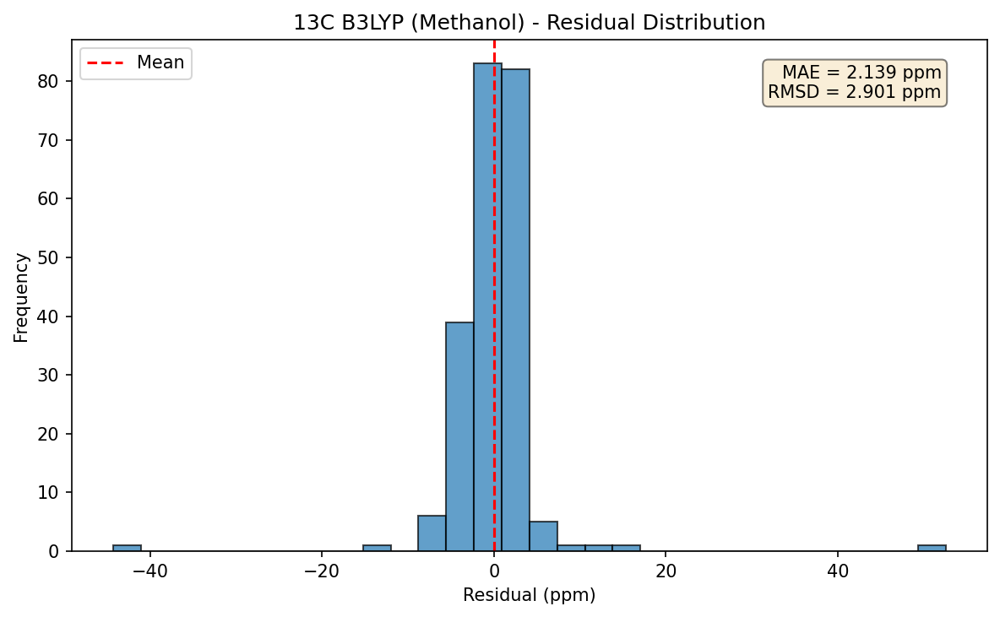
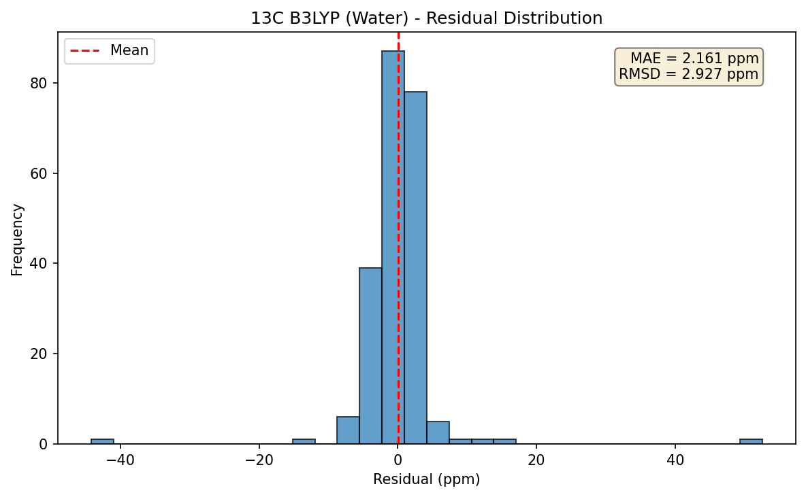
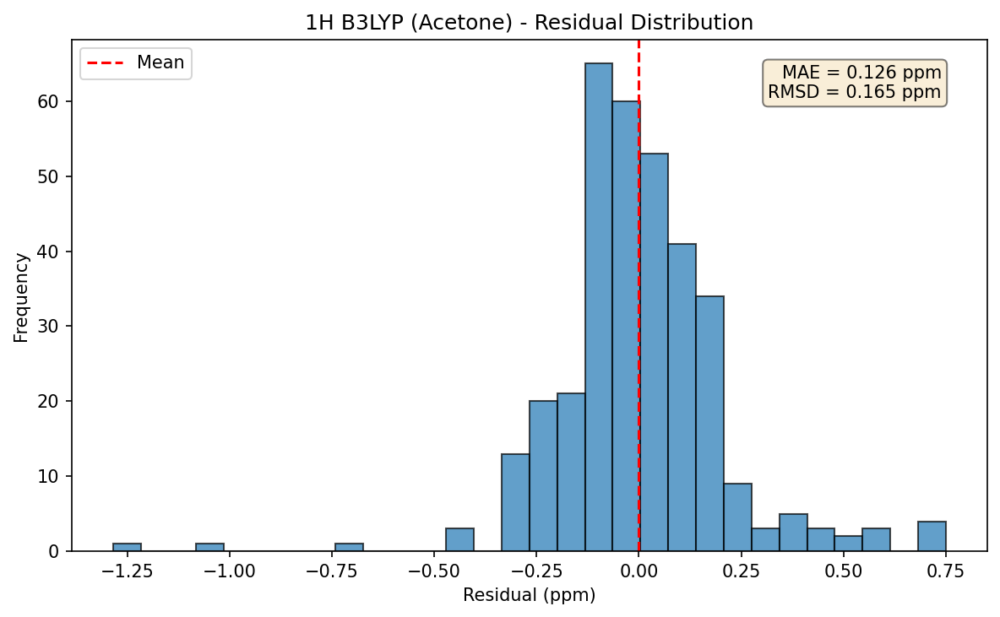
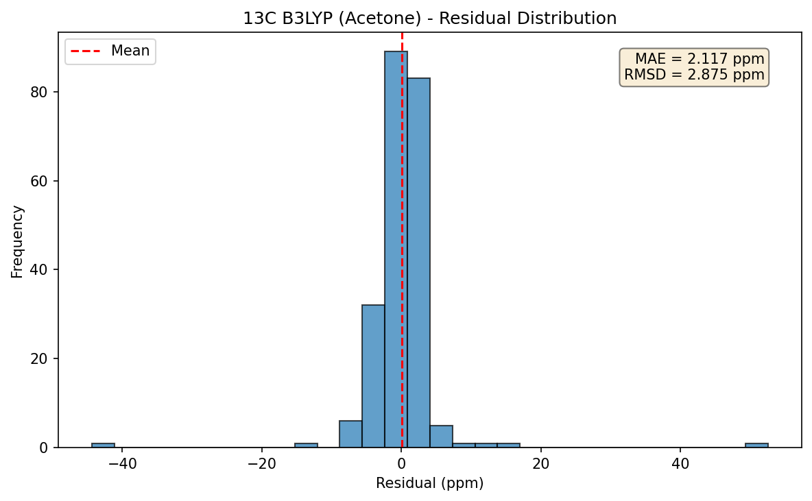
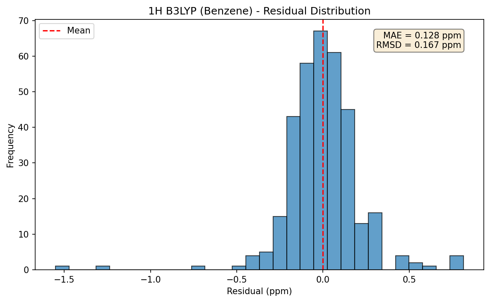
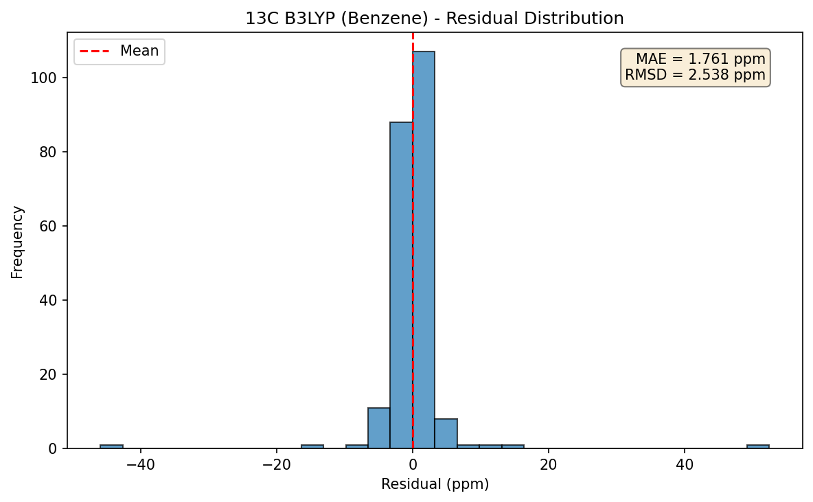

# DELTA50 NMR Scaling Factors

Derived from DELTA50 benchmark data using B3LYP/6-311+G(2d,p) calculations.

## Methodology

Scaling factors convert calculated NMR shielding values (sigma) to predicted
chemical shifts (delta) using linear regression:

```
delta = slope * sigma + intercept
```

**Fitting procedure:**
1. Aggregate shielding-shift pairs across all DELTA50 compounds
2. Fit ordinary least squares (OLS) regression
3. Identify outliers with residuals > 3 standard deviations
4. Refit without outliers
5. Report final statistics with 95% confidence intervals

**Training data:** DELTA50 benchmark set (50 small organic molecules with
experimentally assigned NMR spectra in CDCl3).

## Scaling Factors

| Nucleus | Solvent | Slope | Intercept | R^2 | MAE (ppm) | RMSD (ppm) | n |
|---------|---------|-------|-----------|-----|-----------|------------|---|
| 13C | Acetone | -0.9440 (-0.9503, -0.9376) | 171.91 (171.20, 172.62) | 0.9975 | 2.117 | 2.875 | 219 |
| 13C | Benzene | -0.9573 (-0.9630, -0.9516) | 173.70 (173.07, 174.33) | 0.9980 | 1.761 | 2.538 | 219 |
| 13C | CHCl3 | -0.9497 (-0.9557, -0.9438) | 172.69 (172.02, 173.36) | 0.9978 | 1.949 | 2.691 | 219 |
| 13C | DMSO | -0.9429 (-0.9494, -0.9365) | 171.77 (171.05, 172.49) | 0.9974 | 2.152 | 2.916 | 219 |
| 13C | Methanol | -0.9433 (-0.9497, -0.9369) | 171.82 (171.10, 172.53) | 0.9974 | 2.139 | 2.901 | 219 |
| 13C | vacuum | -0.9726 (-0.9785, -0.9668) | 175.71 (175.06, 176.36) | 0.9980 | 1.739 | 2.565 | 219 |
| 13C | Water | -0.9426 (-0.9490, -0.9361) | 171.72 (171.00, 172.44) | 0.9974 | 2.161 | 2.927 | 219 |
| 1H | Acetone | -0.9332 (-0.9402, -0.9261) | 29.76 (29.56, 29.96) | 0.9951 | 0.126 | 0.165 | 335 |
| 1H | Benzene | -0.9433 (-0.9505, -0.9361) | 30.12 (29.92, 30.33) | 0.9950 | 0.128 | 0.167 | 335 |
| 1H | CHCl3 | -0.9375 (-0.9445, -0.9305) | 29.92 (29.72, 30.12) | 0.9952 | 0.124 | 0.163 | 335 |
| 1H | DMSO | -0.9323 (-0.9394, -0.9253) | 29.73 (29.53, 29.94) | 0.9951 | 0.126 | 0.166 | 335 |
| 1H | Methanol | -0.9326 (-0.9397, -0.9256) | 29.74 (29.54, 29.95) | 0.9951 | 0.126 | 0.166 | 335 |
| 1H | vacuum | -0.9554 (-0.9638, -0.9470) | 30.54 (30.30, 30.79) | 0.9934 | 0.148 | 0.193 | 336 |
| 1H | Water | -0.9321 (-0.9392, -0.9250) | 29.73 (29.53, 29.93) | 0.9951 | 0.127 | 0.166 | 335 |

*Values in parentheses are 95% confidence intervals.*

## Statistical Summary

### 1H B3LYP (CHCl3)

| Compound | Mean Error (ppm) | Max Error (ppm) | Atoms |
|----------|------------------|-----------------|-------|
| compound_17 | 0.496 | 1.403 | 9 |
| compound_10 | 0.494 | 1.130 | 7 |
| compound_07 | 0.288 | 0.398 | 6 |
| compound_30 | 0.271 | 0.586 | 11 |
| compound_15 | 0.234 | 0.396 | 9 |
| compound_40 | 0.218 | 0.491 | 13 |
| compound_37 | 0.194 | 0.243 | 12 |
| compound_03 | 0.189 | 0.327 | 4 |
| compound_27 | 0.183 | 0.689 | 10 |
| compound_28 | 0.169 | 0.442 | 12 |
| compound_26 | 0.168 | 0.252 | 10 |
| compound_22 | 0.167 | 0.236 | 4 |
| compound_32 | 0.156 | 0.260 | 9 |
| compound_09 | 0.154 | 0.302 | 6 |
| compound_49 | 0.143 | 0.143 | 2 |
| compound_29 | 0.131 | 0.260 | 10 |
| compound_20 | 0.126 | 0.175 | 7 |
| compound_23 | 0.126 | 0.212 | 4 |
| compound_38 | 0.125 | 0.188 | 10 |
| compound_41 | 0.125 | 0.237 | 10 |
| compound_45 | 0.122 | 0.122 | 4 |
| compound_50 | 0.118 | 0.152 | 6 |
| compound_01 | 0.112 | 0.126 | 3 |
| compound_47 | 0.108 | 0.156 | 8 |
| compound_02 | 0.100 | 0.399 | 5 |
| compound_33 | 0.096 | 0.190 | 6 |
| compound_19 | 0.096 | 0.200 | 6 |
| compound_25 | 0.096 | 0.145 | 4 |
| compound_16 | 0.095 | 0.179 | 8 |
| compound_36 | 0.093 | 0.186 | 12 |
| compound_14 | 0.091 | 0.091 | 6 |
| compound_24 | 0.090 | 0.090 | 4 |
| compound_12 | 0.087 | 0.138 | 3 |
| compound_42 | 0.086 | 0.216 | 8 |
| compound_13 | 0.083 | 0.167 | 8 |
| compound_44 | 0.074 | 0.133 | 5 |
| compound_48 | 0.069 | 0.130 | 8 |
| compound_31 | 0.066 | 0.129 | 8 |
| compound_46 | 0.065 | 0.218 | 8 |
| compound_21 | 0.062 | 0.079 | 4 |
| compound_06 | 0.054 | 0.059 | 6 |
| compound_34 | 0.052 | 0.081 | 7 |
| compound_35 | 0.049 | 0.107 | 5 |
| compound_18 | 0.047 | 0.062 | 6 |
| compound_04 | 0.046 | 0.046 | 4 |
| compound_11 | 0.046 | 0.091 | 5 |
| compound_08 | 0.033 | 0.034 | 6 |
| compound_39 | 0.032 | 0.039 | 6 |
| compound_43 | 0.031 | 0.038 | 5 |
| compound_05 | 0.011 | 0.014 | 3 |

**Note:** Compounds with mean error > 2x MAE (0.248 ppm):
compound_17, compound_10, compound_07, compound_30

### 13C B3LYP (CHCl3)

| Compound | Mean Error (ppm) | Max Error (ppm) | Atoms |
|----------|------------------|-----------------|-------|
| compound_48 | 20.939 | 52.512 | 7 |
| compound_10 | 5.006 | 8.745 | 3 |
| compound_17 | 3.070 | 5.031 | 4 |
| compound_28 | 2.958 | 4.598 | 5 |
| compound_36 | 2.775 | 5.718 | 6 |
| compound_13 | 2.748 | 5.938 | 4 |
| compound_05 | 2.610 | 2.985 | 2 |
| compound_33 | 2.562 | 4.678 | 5 |
| compound_41 | 2.502 | 3.469 | 6 |
| compound_42 | 2.468 | 4.812 | 6 |
| compound_15 | 2.357 | 5.270 | 4 |
| compound_18 | 2.336 | 6.124 | 4 |
| compound_47 | 2.292 | 3.512 | 7 |
| compound_26 | 2.277 | 3.709 | 5 |
| compound_34 | 2.245 | 2.369 | 5 |
| compound_31 | 2.244 | 2.885 | 5 |
| compound_32 | 2.043 | 3.964 | 5 |
| compound_40 | 1.921 | 2.476 | 6 |
| compound_38 | 1.900 | 3.455 | 6 |
| compound_22 | 1.815 | 2.656 | 4 |
| compound_39 | 1.781 | 1.889 | 6 |
| compound_03 | 1.741 | 2.204 | 2 |
| compound_46 | 1.708 | 2.274 | 7 |
| compound_20 | 1.629 | 3.343 | 4 |
| compound_19 | 1.537 | 2.828 | 4 |
| compound_07 | 1.525 | 2.360 | 3 |
| compound_37 | 1.504 | 1.520 | 6 |
| compound_11 | 1.490 | 2.475 | 3 |
| compound_43 | 1.477 | 1.715 | 6 |
| compound_45 | 1.447 | 1.559 | 6 |
| compound_02 | 1.429 | 1.596 | 2 |
| compound_29 | 1.415 | 1.913 | 5 |
| compound_35 | 1.390 | 1.709 | 5 |
| compound_49 | 1.371 | 2.712 | 4 |
| compound_16 | 1.362 | 2.617 | 4 |
| compound_21 | 1.305 | 1.414 | 4 |
| compound_04 | 1.223 | 1.223 | 2 |
| compound_25 | 1.222 | 1.672 | 4 |
| compound_30 | 1.158 | 3.092 | 5 |
| compound_27 | 1.102 | 2.833 | 5 |
| compound_09 | 1.004 | 1.316 | 3 |
| compound_23 | 0.993 | 1.587 | 4 |
| compound_44 | 0.991 | 1.910 | 6 |
| compound_24 | 0.853 | 0.853 | 4 |
| compound_12 | 0.769 | 1.812 | 3 |
| compound_14 | 0.697 | 1.326 | 4 |
| compound_50 | 0.545 | 1.017 | 4 |
| compound_01 | 0.354 | 0.354 | 1 |
| compound_06 | 0.215 | 0.252 | 3 |
| compound_08 | 0.172 | 0.176 | 3 |

**Note:** Compounds with mean error > 2x MAE (3.898 ppm):
compound_48, compound_10

### 1H B3LYP (DMSO)

| Compound | Mean Error (ppm) | Max Error (ppm) | Atoms |
|----------|------------------|-----------------|-------|
| compound_17 | 0.495 | 1.263 | 9 |
| compound_10 | 0.466 | 1.005 | 7 |
| compound_07 | 0.352 | 0.460 | 6 |
| compound_30 | 0.268 | 0.581 | 11 |
| compound_03 | 0.243 | 0.381 | 4 |
| compound_22 | 0.228 | 0.265 | 4 |
| compound_40 | 0.219 | 0.490 | 13 |
| compound_15 | 0.193 | 0.338 | 9 |
| compound_37 | 0.188 | 0.217 | 12 |
| compound_28 | 0.183 | 0.449 | 12 |
| compound_27 | 0.177 | 0.677 | 10 |
| compound_09 | 0.172 | 0.318 | 6 |
| compound_26 | 0.161 | 0.228 | 10 |
| compound_23 | 0.154 | 0.299 | 4 |
| compound_41 | 0.146 | 0.244 | 10 |
| compound_32 | 0.134 | 0.215 | 9 |
| compound_33 | 0.127 | 0.276 | 6 |
| compound_42 | 0.125 | 0.310 | 8 |
| compound_25 | 0.125 | 0.197 | 4 |
| compound_20 | 0.121 | 0.155 | 7 |
| compound_45 | 0.118 | 0.118 | 4 |
| compound_02 | 0.111 | 0.350 | 5 |
| compound_24 | 0.111 | 0.111 | 4 |
| compound_29 | 0.111 | 0.247 | 10 |
| compound_50 | 0.106 | 0.132 | 6 |
| compound_01 | 0.102 | 0.130 | 3 |
| compound_12 | 0.098 | 0.119 | 3 |
| compound_38 | 0.098 | 0.167 | 10 |
| compound_16 | 0.096 | 0.155 | 8 |
| compound_49 | 0.096 | 0.096 | 2 |
| compound_47 | 0.094 | 0.128 | 8 |
| compound_36 | 0.094 | 0.203 | 12 |
| compound_35 | 0.090 | 0.172 | 5 |
| compound_14 | 0.087 | 0.087 | 6 |
| compound_19 | 0.084 | 0.171 | 6 |
| compound_13 | 0.075 | 0.150 | 8 |
| compound_21 | 0.073 | 0.094 | 4 |
| compound_31 | 0.064 | 0.127 | 8 |
| compound_11 | 0.063 | 0.120 | 5 |
| compound_48 | 0.063 | 0.116 | 8 |
| compound_46 | 0.062 | 0.198 | 8 |
| compound_44 | 0.056 | 0.096 | 5 |
| compound_34 | 0.055 | 0.103 | 7 |
| compound_06 | 0.048 | 0.055 | 6 |
| compound_18 | 0.048 | 0.069 | 6 |
| compound_05 | 0.046 | 0.050 | 3 |
| compound_43 | 0.031 | 0.042 | 5 |
| compound_08 | 0.030 | 0.034 | 6 |
| compound_39 | 0.025 | 0.033 | 6 |
| compound_04 | 0.017 | 0.017 | 4 |

**Note:** Compounds with mean error > 2x MAE (0.253 ppm):
compound_17, compound_10, compound_07, compound_30

### 13C B3LYP (DMSO)

| Compound | Mean Error (ppm) | Max Error (ppm) | Atoms |
|----------|------------------|-----------------|-------|
| compound_48 | 20.858 | 52.561 | 7 |
| compound_10 | 5.021 | 8.686 | 3 |
| compound_05 | 3.234 | 4.467 | 2 |
| compound_33 | 3.148 | 6.201 | 5 |
| compound_17 | 3.126 | 5.045 | 4 |
| compound_13 | 3.019 | 6.067 | 4 |
| compound_18 | 2.973 | 8.028 | 4 |
| compound_42 | 2.962 | 6.584 | 6 |
| compound_28 | 2.951 | 4.580 | 5 |
| compound_36 | 2.904 | 5.709 | 6 |
| compound_41 | 2.901 | 4.021 | 6 |
| compound_31 | 2.773 | 4.403 | 5 |
| compound_34 | 2.686 | 3.406 | 5 |
| compound_15 | 2.657 | 6.081 | 4 |
| compound_03 | 2.629 | 3.599 | 2 |
| compound_22 | 2.416 | 2.895 | 4 |
| compound_32 | 2.359 | 4.311 | 5 |
| compound_26 | 2.265 | 3.689 | 5 |
| compound_39 | 2.258 | 2.392 | 6 |
| compound_40 | 2.067 | 2.646 | 6 |
| compound_46 | 2.054 | 2.899 | 7 |
| compound_11 | 1.973 | 3.699 | 3 |
| compound_38 | 1.956 | 3.554 | 6 |
| compound_20 | 1.954 | 3.537 | 4 |
| compound_47 | 1.947 | 3.481 | 7 |
| compound_19 | 1.863 | 3.020 | 4 |
| compound_43 | 1.712 | 2.073 | 6 |
| compound_35 | 1.701 | 1.939 | 5 |
| compound_07 | 1.701 | 3.801 | 3 |
| compound_21 | 1.689 | 1.919 | 4 |
| compound_02 | 1.668 | 1.938 | 2 |
| compound_29 | 1.508 | 1.975 | 5 |
| compound_37 | 1.495 | 1.515 | 6 |
| compound_45 | 1.478 | 1.576 | 6 |
| compound_23 | 1.398 | 1.488 | 4 |
| compound_44 | 1.395 | 2.090 | 6 |
| compound_24 | 1.331 | 1.331 | 4 |
| compound_49 | 1.327 | 2.640 | 4 |
| compound_16 | 1.318 | 2.617 | 4 |
| compound_30 | 1.275 | 3.230 | 5 |
| compound_04 | 1.077 | 1.077 | 2 |
| compound_01 | 1.021 | 1.021 | 1 |
| compound_25 | 0.959 | 0.975 | 4 |
| compound_09 | 0.948 | 1.502 | 3 |
| compound_27 | 0.907 | 2.592 | 5 |
| compound_12 | 0.741 | 1.629 | 3 |
| compound_14 | 0.707 | 1.302 | 4 |
| compound_50 | 0.651 | 0.828 | 4 |
| compound_06 | 0.147 | 0.194 | 3 |
| compound_08 | 0.015 | 0.018 | 3 |

**Note:** Compounds with mean error > 2x MAE (4.304 ppm):
compound_48, compound_10

### 1H B3LYP (Methanol)

| Compound | Mean Error (ppm) | Max Error (ppm) | Atoms |
|----------|------------------|-----------------|-------|
| compound_17 | 0.495 | 1.271 | 9 |
| compound_10 | 0.468 | 1.012 | 7 |
| compound_07 | 0.348 | 0.456 | 6 |
| compound_30 | 0.268 | 0.581 | 11 |
| compound_03 | 0.240 | 0.377 | 4 |
| compound_22 | 0.225 | 0.262 | 4 |
| compound_40 | 0.219 | 0.490 | 13 |
| compound_15 | 0.195 | 0.341 | 9 |
| compound_37 | 0.188 | 0.219 | 12 |
| compound_28 | 0.182 | 0.449 | 12 |
| compound_27 | 0.177 | 0.678 | 10 |
| compound_09 | 0.171 | 0.317 | 6 |
| compound_26 | 0.161 | 0.229 | 10 |
| compound_23 | 0.153 | 0.295 | 4 |
| compound_41 | 0.145 | 0.243 | 10 |
| compound_32 | 0.135 | 0.218 | 9 |
| compound_33 | 0.126 | 0.271 | 6 |
| compound_42 | 0.123 | 0.305 | 8 |
| compound_25 | 0.121 | 0.194 | 4 |
| compound_20 | 0.120 | 0.156 | 7 |
| compound_45 | 0.119 | 0.120 | 4 |
| compound_29 | 0.112 | 0.248 | 10 |
| compound_02 | 0.110 | 0.352 | 5 |
| compound_24 | 0.110 | 0.110 | 4 |
| compound_50 | 0.107 | 0.133 | 6 |
| compound_01 | 0.103 | 0.128 | 3 |
| compound_38 | 0.099 | 0.168 | 10 |
| compound_49 | 0.098 | 0.098 | 2 |
| compound_12 | 0.098 | 0.120 | 3 |
| compound_16 | 0.096 | 0.156 | 8 |
| compound_47 | 0.095 | 0.130 | 8 |
| compound_36 | 0.094 | 0.201 | 12 |
| compound_35 | 0.088 | 0.169 | 5 |
| compound_14 | 0.087 | 0.088 | 6 |
| compound_19 | 0.085 | 0.173 | 6 |
| compound_13 | 0.074 | 0.150 | 8 |
| compound_21 | 0.072 | 0.093 | 4 |
| compound_31 | 0.064 | 0.128 | 8 |
| compound_46 | 0.063 | 0.200 | 8 |
| compound_48 | 0.063 | 0.118 | 8 |
| compound_11 | 0.061 | 0.116 | 5 |
| compound_44 | 0.057 | 0.095 | 5 |
| compound_34 | 0.055 | 0.102 | 7 |
| compound_06 | 0.049 | 0.055 | 6 |
| compound_18 | 0.048 | 0.069 | 6 |
| compound_05 | 0.043 | 0.046 | 3 |
| compound_43 | 0.031 | 0.042 | 5 |
| compound_08 | 0.030 | 0.035 | 6 |
| compound_39 | 0.024 | 0.031 | 6 |
| compound_04 | 0.018 | 0.018 | 4 |

**Note:** Compounds with mean error > 2x MAE (0.252 ppm):
compound_17, compound_10, compound_07, compound_30

### 13C B3LYP (Methanol)

| Compound | Mean Error (ppm) | Max Error (ppm) | Atoms |
|----------|------------------|-----------------|-------|
| compound_48 | 20.861 | 52.556 | 7 |
| compound_10 | 5.024 | 8.695 | 3 |
| compound_05 | 3.192 | 4.376 | 2 |
| compound_17 | 3.122 | 5.044 | 4 |
| compound_33 | 3.116 | 6.120 | 5 |
| compound_13 | 3.007 | 6.071 | 4 |
| compound_28 | 2.951 | 4.581 | 5 |
| compound_18 | 2.942 | 7.934 | 4 |
| compound_42 | 2.935 | 6.489 | 6 |
| compound_36 | 2.900 | 5.710 | 6 |
| compound_41 | 2.884 | 3.949 | 6 |
| compound_31 | 2.748 | 4.330 | 5 |
| compound_34 | 2.663 | 3.352 | 5 |
| compound_15 | 2.641 | 6.030 | 4 |
| compound_03 | 2.581 | 3.522 | 2 |
| compound_22 | 2.381 | 2.879 | 4 |
| compound_32 | 2.325 | 4.228 | 5 |
| compound_26 | 2.266 | 3.690 | 5 |
| compound_39 | 2.218 | 2.354 | 6 |
| compound_40 | 2.061 | 2.635 | 6 |
| compound_46 | 2.031 | 2.848 | 7 |
| compound_47 | 1.964 | 3.483 | 7 |
| compound_38 | 1.955 | 3.553 | 6 |
| compound_11 | 1.945 | 3.622 | 3 |
| compound_20 | 1.926 | 3.502 | 4 |
| compound_19 | 1.843 | 3.008 | 4 |
| compound_07 | 1.693 | 3.719 | 3 |
| compound_35 | 1.688 | 1.895 | 5 |
| compound_43 | 1.687 | 2.055 | 6 |
| compound_21 | 1.670 | 1.892 | 4 |
| compound_02 | 1.656 | 1.904 | 2 |
| compound_29 | 1.501 | 1.968 | 5 |
| compound_37 | 1.497 | 1.517 | 6 |
| compound_45 | 1.472 | 1.562 | 6 |
| compound_44 | 1.374 | 2.084 | 6 |
| compound_23 | 1.369 | 1.463 | 4 |
| compound_49 | 1.328 | 2.640 | 4 |
| compound_16 | 1.314 | 2.616 | 4 |
| compound_24 | 1.309 | 1.309 | 4 |
| compound_30 | 1.269 | 3.222 | 5 |
| compound_04 | 1.084 | 1.084 | 2 |
| compound_01 | 0.988 | 0.988 | 1 |
| compound_25 | 0.975 | 0.982 | 4 |
| compound_09 | 0.949 | 1.487 | 3 |
| compound_27 | 0.918 | 2.609 | 5 |
| compound_12 | 0.743 | 1.642 | 3 |
| compound_14 | 0.707 | 1.307 | 4 |
| compound_50 | 0.643 | 0.837 | 4 |
| compound_06 | 0.151 | 0.196 | 3 |
| compound_08 | 0.006 | 0.009 | 3 |

**Note:** Compounds with mean error > 2x MAE (4.279 ppm):
compound_48, compound_10

### 1H B3LYP (Water)

| Compound | Mean Error (ppm) | Max Error (ppm) | Atoms |
|----------|------------------|-----------------|-------|
| compound_17 | 0.495 | 1.256 | 9 |
| compound_10 | 0.465 | 0.999 | 7 |
| compound_07 | 0.355 | 0.463 | 6 |
| compound_30 | 0.268 | 0.581 | 11 |
| compound_03 | 0.246 | 0.383 | 4 |
| compound_22 | 0.231 | 0.267 | 4 |
| compound_40 | 0.219 | 0.490 | 13 |
| compound_15 | 0.191 | 0.335 | 9 |
| compound_37 | 0.188 | 0.216 | 12 |
| compound_28 | 0.184 | 0.450 | 12 |
| compound_27 | 0.177 | 0.677 | 10 |
| compound_09 | 0.173 | 0.319 | 6 |
| compound_26 | 0.160 | 0.227 | 10 |
| compound_23 | 0.158 | 0.304 | 4 |
| compound_41 | 0.147 | 0.244 | 10 |
| compound_32 | 0.132 | 0.213 | 9 |
| compound_33 | 0.129 | 0.280 | 6 |
| compound_25 | 0.129 | 0.199 | 4 |
| compound_42 | 0.127 | 0.315 | 8 |
| compound_20 | 0.120 | 0.154 | 7 |
| compound_45 | 0.119 | 0.120 | 4 |
| compound_02 | 0.112 | 0.347 | 5 |
| compound_24 | 0.112 | 0.112 | 4 |
| compound_29 | 0.110 | 0.246 | 10 |
| compound_50 | 0.106 | 0.131 | 6 |
| compound_01 | 0.102 | 0.133 | 3 |
| compound_12 | 0.099 | 0.118 | 3 |
| compound_38 | 0.097 | 0.166 | 10 |
| compound_16 | 0.096 | 0.153 | 8 |
| compound_36 | 0.094 | 0.204 | 12 |
| compound_47 | 0.094 | 0.127 | 8 |
| compound_49 | 0.093 | 0.093 | 2 |
| compound_35 | 0.093 | 0.176 | 5 |
| compound_14 | 0.087 | 0.087 | 6 |
| compound_19 | 0.084 | 0.170 | 6 |
| compound_13 | 0.075 | 0.148 | 8 |
| compound_21 | 0.073 | 0.095 | 4 |
| compound_31 | 0.065 | 0.128 | 8 |
| compound_11 | 0.064 | 0.122 | 5 |
| compound_48 | 0.063 | 0.116 | 8 |
| compound_46 | 0.063 | 0.198 | 8 |
| compound_44 | 0.056 | 0.099 | 5 |
| compound_34 | 0.056 | 0.104 | 7 |
| compound_05 | 0.049 | 0.052 | 3 |
| compound_06 | 0.048 | 0.054 | 6 |
| compound_18 | 0.048 | 0.070 | 6 |
| compound_43 | 0.031 | 0.043 | 5 |
| compound_08 | 0.030 | 0.035 | 6 |
| compound_39 | 0.023 | 0.030 | 6 |
| compound_04 | 0.015 | 0.015 | 4 |

**Note:** Compounds with mean error > 2x MAE (0.253 ppm):
compound_17, compound_10, compound_07, compound_30

### 13C B3LYP (Water)

| Compound | Mean Error (ppm) | Max Error (ppm) | Atoms |
|----------|------------------|-----------------|-------|
| compound_48 | 20.853 | 52.560 | 7 |
| compound_10 | 5.027 | 8.689 | 3 |
| compound_05 | 3.254 | 4.526 | 2 |
| compound_33 | 3.178 | 6.281 | 5 |
| compound_17 | 3.129 | 5.045 | 4 |
| compound_13 | 3.035 | 6.083 | 4 |
| compound_18 | 3.007 | 8.125 | 4 |
| compound_42 | 2.988 | 6.677 | 6 |
| compound_28 | 2.950 | 4.579 | 5 |
| compound_41 | 2.924 | 4.098 | 6 |
| compound_36 | 2.913 | 5.709 | 6 |
| compound_31 | 2.802 | 4.482 | 5 |
| compound_34 | 2.708 | 3.458 | 5 |
| compound_15 | 2.671 | 6.111 | 4 |
| compound_03 | 2.670 | 3.661 | 2 |
| compound_22 | 2.442 | 2.905 | 4 |
| compound_32 | 2.356 | 4.262 | 5 |
| compound_39 | 2.267 | 2.403 | 6 |
| compound_26 | 2.265 | 3.688 | 5 |
| compound_40 | 2.075 | 2.651 | 6 |
| compound_46 | 2.066 | 2.913 | 7 |
| compound_11 | 1.994 | 3.747 | 3 |
| compound_38 | 1.960 | 3.563 | 6 |
| compound_20 | 1.959 | 3.522 | 4 |
| compound_47 | 1.929 | 3.480 | 7 |
| compound_19 | 1.875 | 3.029 | 4 |
| compound_43 | 1.736 | 2.091 | 6 |
| compound_35 | 1.720 | 1.985 | 5 |
| compound_07 | 1.710 | 3.864 | 3 |
| compound_21 | 1.709 | 1.945 | 4 |
| compound_02 | 1.680 | 1.972 | 2 |
| compound_29 | 1.511 | 1.975 | 5 |
| compound_37 | 1.496 | 1.516 | 6 |
| compound_45 | 1.475 | 1.582 | 6 |
| compound_44 | 1.416 | 2.101 | 6 |
| compound_23 | 1.410 | 1.499 | 4 |
| compound_24 | 1.358 | 1.358 | 4 |
| compound_49 | 1.322 | 2.631 | 4 |
| compound_16 | 1.320 | 2.616 | 4 |
| compound_30 | 1.281 | 3.236 | 5 |
| compound_04 | 1.069 | 1.069 | 2 |
| compound_01 | 1.056 | 1.056 | 1 |
| compound_25 | 0.946 | 0.988 | 4 |
| compound_09 | 0.942 | 1.504 | 3 |
| compound_27 | 0.897 | 2.584 | 5 |
| compound_12 | 0.740 | 1.622 | 3 |
| compound_14 | 0.708 | 1.303 | 4 |
| compound_50 | 0.661 | 0.818 | 4 |
| compound_06 | 0.143 | 0.189 | 3 |
| compound_08 | 0.026 | 0.029 | 3 |

**Note:** Compounds with mean error > 2x MAE (4.323 ppm):
compound_48, compound_10

### 1H B3LYP (Acetone)

| Compound | Mean Error (ppm) | Max Error (ppm) | Atoms |
|----------|------------------|-----------------|-------|
| compound_17 | 0.495 | 1.285 | 9 |
| compound_10 | 0.470 | 1.024 | 7 |
| compound_07 | 0.342 | 0.450 | 6 |
| compound_30 | 0.269 | 0.582 | 11 |
| compound_03 | 0.234 | 0.372 | 4 |
| compound_40 | 0.219 | 0.490 | 13 |
| compound_22 | 0.219 | 0.257 | 4 |
| compound_15 | 0.199 | 0.347 | 9 |
| compound_37 | 0.189 | 0.221 | 12 |
| compound_28 | 0.181 | 0.448 | 12 |
| compound_27 | 0.178 | 0.679 | 10 |
| compound_09 | 0.169 | 0.316 | 6 |
| compound_26 | 0.162 | 0.231 | 10 |
| compound_23 | 0.148 | 0.286 | 4 |
| compound_41 | 0.142 | 0.242 | 10 |
| compound_32 | 0.137 | 0.222 | 9 |
| compound_33 | 0.122 | 0.262 | 6 |
| compound_20 | 0.121 | 0.158 | 7 |
| compound_45 | 0.120 | 0.120 | 4 |
| compound_42 | 0.119 | 0.295 | 8 |
| compound_29 | 0.114 | 0.249 | 10 |
| compound_25 | 0.113 | 0.189 | 4 |
| compound_50 | 0.108 | 0.135 | 6 |
| compound_24 | 0.108 | 0.108 | 4 |
| compound_02 | 0.108 | 0.358 | 5 |
| compound_01 | 0.104 | 0.124 | 3 |
| compound_49 | 0.102 | 0.102 | 2 |
| compound_38 | 0.102 | 0.170 | 10 |
| compound_47 | 0.096 | 0.133 | 8 |
| compound_12 | 0.096 | 0.122 | 3 |
| compound_16 | 0.096 | 0.158 | 8 |
| compound_36 | 0.093 | 0.197 | 12 |
| compound_14 | 0.087 | 0.088 | 6 |
| compound_19 | 0.086 | 0.176 | 6 |
| compound_35 | 0.083 | 0.162 | 5 |
| compound_13 | 0.074 | 0.152 | 8 |
| compound_21 | 0.071 | 0.092 | 4 |
| compound_31 | 0.064 | 0.128 | 8 |
| compound_46 | 0.063 | 0.202 | 8 |
| compound_48 | 0.063 | 0.119 | 8 |
| compound_44 | 0.059 | 0.093 | 5 |
| compound_11 | 0.058 | 0.109 | 5 |
| compound_34 | 0.055 | 0.100 | 7 |
| compound_06 | 0.049 | 0.055 | 6 |
| compound_18 | 0.048 | 0.068 | 6 |
| compound_05 | 0.037 | 0.040 | 3 |
| compound_43 | 0.032 | 0.042 | 5 |
| compound_08 | 0.030 | 0.035 | 6 |
| compound_39 | 0.025 | 0.032 | 6 |
| compound_04 | 0.021 | 0.021 | 4 |

**Note:** Compounds with mean error > 2x MAE (0.252 ppm):
compound_17, compound_10, compound_07, compound_30

### 13C B3LYP (Acetone)

| Compound | Mean Error (ppm) | Max Error (ppm) | Atoms |
|----------|------------------|-----------------|-------|
| compound_48 | 20.869 | 52.551 | 7 |
| compound_10 | 5.017 | 8.695 | 3 |
| compound_05 | 3.129 | 4.226 | 2 |
| compound_17 | 3.116 | 5.043 | 4 |
| compound_33 | 3.054 | 5.959 | 5 |
| compound_13 | 2.980 | 6.058 | 4 |
| compound_28 | 2.952 | 4.583 | 5 |
| compound_36 | 2.887 | 5.712 | 6 |
| compound_42 | 2.883 | 6.303 | 6 |
| compound_18 | 2.878 | 7.742 | 4 |
| compound_41 | 2.843 | 3.803 | 6 |
| compound_31 | 2.694 | 4.177 | 5 |
| compound_34 | 2.618 | 3.245 | 5 |
| compound_15 | 2.610 | 5.948 | 4 |
| compound_03 | 2.491 | 3.381 | 2 |
| compound_22 | 2.320 | 2.854 | 4 |
| compound_32 | 2.293 | 4.192 | 5 |
| compound_26 | 2.267 | 3.691 | 5 |
| compound_39 | 2.170 | 2.305 | 6 |
| compound_40 | 2.046 | 2.618 | 6 |
| compound_47 | 1.999 | 3.486 | 7 |
| compound_46 | 1.996 | 2.784 | 7 |
| compound_38 | 1.949 | 3.543 | 6 |
| compound_11 | 1.895 | 3.498 | 3 |
| compound_20 | 1.893 | 3.481 | 4 |
| compound_19 | 1.810 | 2.988 | 4 |
| compound_07 | 1.676 | 3.573 | 3 |
| compound_35 | 1.657 | 1.805 | 5 |
| compound_43 | 1.637 | 2.019 | 6 |
| compound_02 | 1.632 | 1.835 | 2 |
| compound_21 | 1.630 | 1.840 | 4 |
| compound_37 | 1.498 | 1.517 | 6 |
| compound_29 | 1.492 | 1.961 | 5 |
| compound_45 | 1.468 | 1.543 | 6 |
| compound_49 | 1.333 | 2.649 | 4 |
| compound_44 | 1.332 | 2.067 | 6 |
| compound_23 | 1.328 | 1.475 | 4 |
| compound_16 | 1.308 | 2.615 | 4 |
| compound_24 | 1.261 | 1.261 | 4 |
| compound_30 | 1.257 | 3.208 | 5 |
| compound_04 | 1.100 | 1.100 | 2 |
| compound_25 | 1.003 | 1.059 | 4 |
| compound_09 | 0.955 | 1.469 | 3 |
| compound_27 | 0.938 | 2.635 | 5 |
| compound_01 | 0.920 | 0.920 | 1 |
| compound_12 | 0.746 | 1.662 | 3 |
| compound_14 | 0.707 | 1.310 | 4 |
| compound_50 | 0.624 | 0.857 | 4 |
| compound_06 | 0.158 | 0.203 | 3 |
| compound_08 | 0.013 | 0.019 | 3 |

**Note:** Compounds with mean error > 2x MAE (4.235 ppm):
compound_48, compound_10

### 1H B3LYP (Benzene)

| Compound | Mean Error (ppm) | Max Error (ppm) | Atoms |
|----------|------------------|-----------------|-------|
| compound_10 | 0.522 | 1.263 | 7 |
| compound_17 | 0.497 | 1.552 | 9 |
| compound_30 | 0.283 | 0.586 | 11 |
| compound_15 | 0.277 | 0.454 | 9 |
| compound_07 | 0.224 | 0.336 | 6 |
| compound_40 | 0.213 | 0.484 | 13 |
| compound_37 | 0.200 | 0.272 | 12 |
| compound_49 | 0.198 | 0.198 | 2 |
| compound_27 | 0.194 | 0.699 | 10 |
| compound_32 | 0.177 | 0.303 | 9 |
| compound_26 | 0.176 | 0.280 | 10 |
| compound_22 | 0.168 | 0.218 | 4 |
| compound_28 | 0.165 | 0.437 | 12 |
| compound_03 | 0.158 | 0.272 | 4 |
| compound_38 | 0.153 | 0.209 | 10 |
| compound_29 | 0.151 | 0.271 | 10 |
| compound_09 | 0.136 | 0.287 | 6 |
| compound_20 | 0.132 | 0.196 | 7 |
| compound_45 | 0.132 | 0.132 | 4 |
| compound_50 | 0.130 | 0.174 | 6 |
| compound_19 | 0.127 | 0.230 | 6 |
| compound_01 | 0.123 | 0.168 | 3 |
| compound_47 | 0.123 | 0.189 | 8 |
| compound_25 | 0.121 | 0.153 | 4 |
| compound_02 | 0.120 | 0.450 | 5 |
| compound_23 | 0.108 | 0.120 | 4 |
| compound_41 | 0.105 | 0.234 | 10 |
| compound_12 | 0.104 | 0.162 | 3 |
| compound_13 | 0.098 | 0.183 | 8 |
| compound_14 | 0.095 | 0.096 | 6 |
| compound_36 | 0.093 | 0.182 | 12 |
| compound_16 | 0.093 | 0.204 | 8 |
| compound_44 | 0.092 | 0.182 | 5 |
| compound_31 | 0.082 | 0.134 | 8 |
| compound_48 | 0.080 | 0.144 | 8 |
| compound_04 | 0.080 | 0.080 | 4 |
| compound_05 | 0.071 | 0.073 | 3 |
| compound_46 | 0.069 | 0.241 | 8 |
| compound_24 | 0.069 | 0.069 | 4 |
| compound_33 | 0.067 | 0.101 | 6 |
| compound_06 | 0.059 | 0.062 | 6 |
| compound_42 | 0.054 | 0.127 | 8 |
| compound_21 | 0.052 | 0.061 | 4 |
| compound_34 | 0.051 | 0.091 | 7 |
| compound_18 | 0.046 | 0.055 | 6 |
| compound_35 | 0.039 | 0.054 | 5 |
| compound_11 | 0.038 | 0.122 | 5 |
| compound_39 | 0.037 | 0.046 | 6 |
| compound_08 | 0.036 | 0.046 | 6 |
| compound_43 | 0.027 | 0.031 | 5 |

**Note:** Compounds with mean error > 2x MAE (0.256 ppm):
compound_10, compound_17, compound_30, compound_15

### 13C B3LYP (Benzene)

| Compound | Mean Error (ppm) | Max Error (ppm) | Atoms |
|----------|------------------|-----------------|-------|
| compound_48 | 21.027 | 52.446 | 7 |
| compound_10 | 5.017 | 8.815 | 3 |
| compound_17 | 3.221 | 5.025 | 4 |
| compound_28 | 2.962 | 4.612 | 5 |
| compound_47 | 2.661 | 3.540 | 7 |
| compound_36 | 2.628 | 5.722 | 6 |
| compound_13 | 2.442 | 5.782 | 4 |
| compound_26 | 2.290 | 3.732 | 5 |
| compound_41 | 2.073 | 3.293 | 6 |
| compound_15 | 2.034 | 4.367 | 4 |
| compound_42 | 1.978 | 3.033 | 6 |
| compound_33 | 1.975 | 3.159 | 5 |
| compound_05 | 1.898 | 2.475 | 2 |
| compound_38 | 1.843 | 3.340 | 6 |
| compound_34 | 1.768 | 2.175 | 5 |
| compound_40 | 1.766 | 2.274 | 6 |
| compound_32 | 1.680 | 3.584 | 5 |
| compound_31 | 1.662 | 2.139 | 5 |
| compound_18 | 1.626 | 3.981 | 4 |
| compound_37 | 1.516 | 1.528 | 6 |
| compound_25 | 1.483 | 2.412 | 4 |
| compound_16 | 1.438 | 2.626 | 4 |
| compound_45 | 1.418 | 1.833 | 6 |
| compound_49 | 1.396 | 2.765 | 4 |
| compound_04 | 1.375 | 1.375 | 2 |
| compound_46 | 1.330 | 1.599 | 7 |
| compound_27 | 1.316 | 3.106 | 5 |
| compound_07 | 1.313 | 1.603 | 3 |
| compound_29 | 1.312 | 1.851 | 5 |
| compound_19 | 1.312 | 2.631 | 4 |
| compound_43 | 1.297 | 1.777 | 6 |
| compound_20 | 1.258 | 3.139 | 4 |
| compound_39 | 1.256 | 1.386 | 6 |
| compound_22 | 1.176 | 2.413 | 4 |
| compound_02 | 1.159 | 1.804 | 2 |
| compound_09 | 1.057 | 1.151 | 3 |
| compound_35 | 1.047 | 1.674 | 5 |
| compound_30 | 1.032 | 2.933 | 5 |
| compound_11 | 0.961 | 1.176 | 3 |
| compound_50 | 0.945 | 1.224 | 4 |
| compound_21 | 0.896 | 0.900 | 4 |
| compound_23 | 0.880 | 1.615 | 4 |
| compound_12 | 0.859 | 1.987 | 3 |
| compound_03 | 0.746 | 0.884 | 2 |
| compound_44 | 0.709 | 1.686 | 6 |
| compound_14 | 0.682 | 1.356 | 4 |
| compound_01 | 0.387 | 0.387 | 1 |
| compound_08 | 0.371 | 0.376 | 3 |
| compound_24 | 0.339 | 0.339 | 4 |
| compound_06 | 0.273 | 0.299 | 3 |

**Note:** Compounds with mean error > 2x MAE (3.522 ppm):
compound_48, compound_10

## Plots

### Regression Analysis











### Residual Distributions

















## Usage

Apply scaling factors to convert calculated shielding to predicted shift:

```python
from qm_nmr_calc.benchmark.analysis import derive_all_factors, get_factor_key

# Get all factors
factors = derive_all_factors()

# Look up specific factor
key = get_factor_key('B3LYP', '6-311+G(2d,p)', '1H', 'CHCl3')
factor = factors[key]

# Convert shielding to shift
shielding = 30.5  # ppm (calculated)
shift = factor.slope * shielding + factor.intercept
print(f'Predicted shift: {shift:.2f} ppm')
```

Or load from JSON:

```python
import json

with open('scaling_factors.json') as f:
    factors = json.load(f)

factor = factors['B3LYP/6-311+G(2d,p)/1H/CHCl3']
shift = factor['slope'] * shielding + factor['intercept']
```

## Notes

- **WP04 factors:** Not yet available (benchmark calculations incomplete)
- **Solvent models:** All solvents use the same experimental chemical shift data
  from the DELTA50 paper (CDCl3 measurements by Grimblat et al. 2023). Solvent
  effects are captured through the COSMO solvation model applied during the DFT
  shielding calculation, not through different experimental references.
- **Vacuum (gas phase):** Calculated without COSMO solvation model. Same
  experimental CDCl3 reference data.
- **Outlier removal:** Applied 3-sigma threshold; number removed varies by
  factor set (typically 7 for 1H, 2 for 13C)

---

*Generated by qm_nmr_calc.benchmark.analysis*