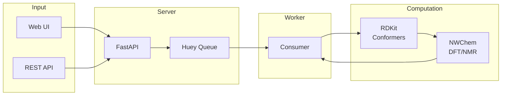
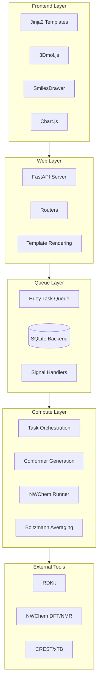
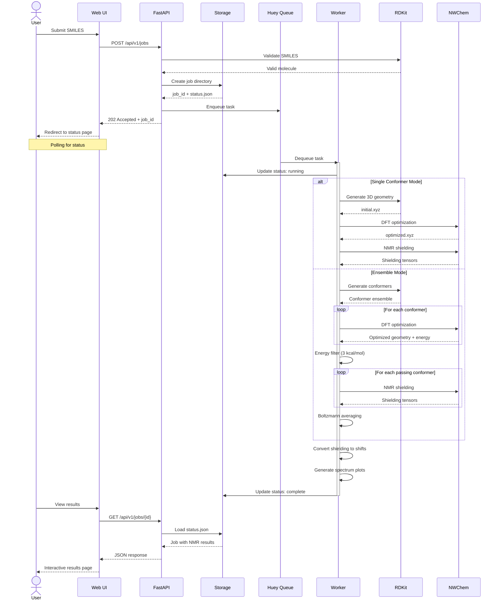
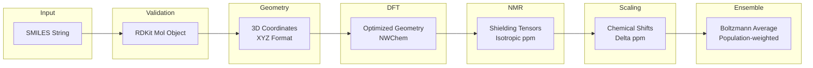
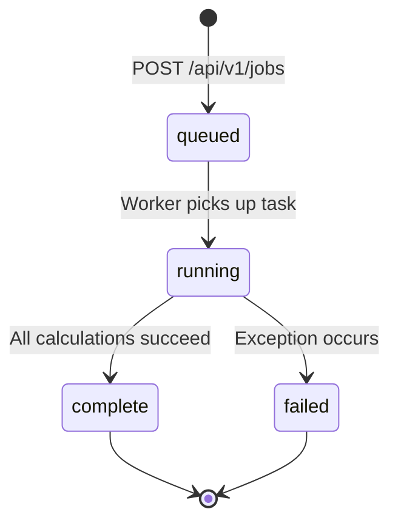
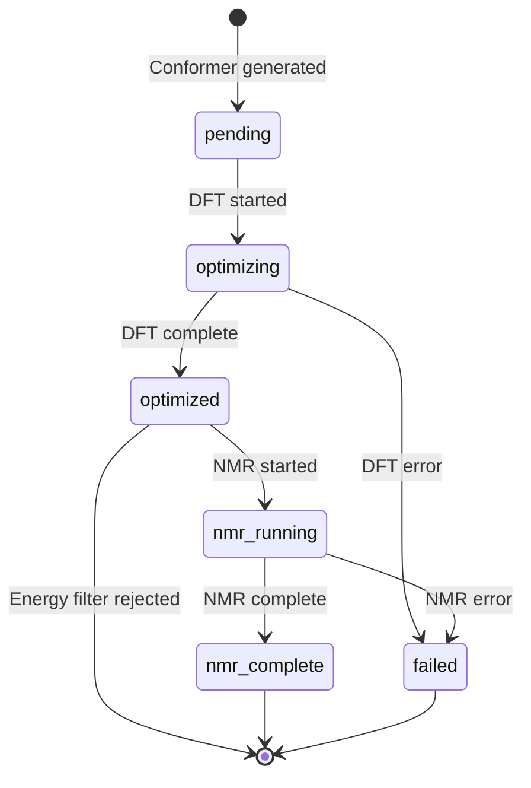
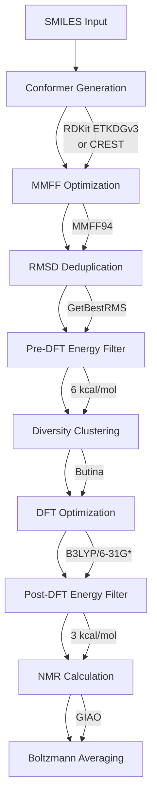
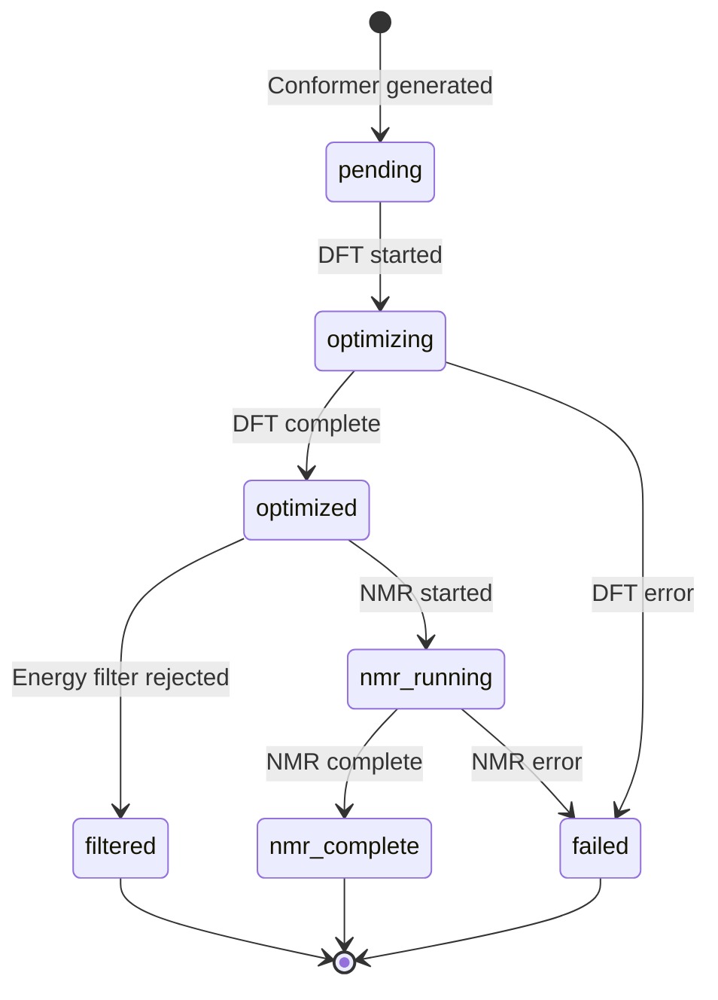

# Technical Architecture

This document describes the internal architecture of the QM NMR Calculator for developers and contributors. It covers the technology stack, data flows, job lifecycle, and file storage structure.

**Audience:** Developers contributing to or extending the codebase.

---

## Architecture Overview



FastAPI handles web requests and queues long-running calculations. The Huey consumer processes jobs sequentially, using RDKit for conformer generation and NWChem for DFT-based NMR calculations.

---

## Technology Stack

The QM NMR Calculator is built on a Python-based async job processing architecture with quantum chemistry computation via NWChem.

### Stack Overview



### Component Table

| Component | Purpose | Key Files |
|-----------|---------|-----------|
| **FastAPI** | HTTP server, REST API, template rendering | `api/app.py`, `api/routers/` |
| **Huey** | Task queue with SQLite backend, signal-based status updates | `queue.py`, `tasks.py` |
| **NWChem** | DFT geometry optimization, GIAO NMR shielding, COSMO solvation | `nwchem/runner.py`, `nwchem/input.py` |
| **RDKit** | SMILES parsing, 3D embedding, conformer generation (ETKDGv3) | `conformers/rdkit_generator.py` |
| **CREST** | GFN2-xTB conformer search (optional, more thorough) | `conformers/crest_generator.py` |
| **Pydantic** | Input validation, job status models, serialization | `models.py` |
| **3Dmol.js** | Interactive 3D molecule viewer in browser | `templates/result.html` |
| **SmilesDrawer** | 2D structure preview on submission page | `templates/submit.html` |
| **Chart.js** | NMR spectrum visualization | `templates/result.html` |

### Technology Choices

**Why Huey over Celery?**
- Simpler setup with SQLite backend (no Redis/RabbitMQ required)
- Single-file database in `data/huey.db`
- Signal-based hooks for status updates (`SIGNAL_EXECUTING`, `SIGNAL_COMPLETE`, `SIGNAL_ERROR`)
- Sufficient for single-worker deployment typical of NMR calculations

**Why NWChem?**
- Open source quantum chemistry package
- GIAO method for NMR shielding calculations
- COSMO implicit solvation model
- MPI parallelization support
- Well-documented input file format

**Why RDKit for conformers?**
- Industry-standard cheminformatics toolkit
- Python bindings with active development
- ETKDGv3 distance geometry for 3D embedding
- MMFF force field for pre-optimization
- Handles SMILES, MOL, and SDF input formats

---

## Data Flow

### Request Flow

This sequence diagram shows the complete flow from job submission to result retrieval:



### Data Transformation Pipeline

Data transforms through multiple stages from input to final results:



**Stage Details:**

1. **SMILES to RDKit Mol**
   - Parse SMILES string with `Chem.MolFromSmiles()`
   - Add explicit hydrogens with `Chem.AddHs()`
   - Validate structure (returns None if invalid)

2. **RDKit Mol to 3D Coordinates**
   - Embed with ETKDGv3 distance geometry
   - Deterministic seed (0xF00D) for reproducibility
   - MMFF force field optimization

3. **3D Coordinates to Optimized Geometry**
   - NWChem B3LYP/6-31G* optimization
   - COSMO solvation model
   - Convergence criteria from preset

4. **Geometry to Shielding Tensors**
   - NWChem GIAO method
   - B3LYP with larger NMR basis (6-311+G(2d,p) for production)
   - COSMO solvation (same as optimization)

5. **Shielding to Chemical Shifts**
   - Linear scaling: shift = (intercept - shielding) / slope
   - Method/basis-specific regression factors
   - Separate parameters for 1H and 13C

6. **Shifts to Boltzmann Average** (ensemble mode)
   - Weight = exp(-E_rel / RT)
   - Normalize weights to sum to 1.0
   - Average: shift_avg = sum(weight_i * shift_i)

---

## Job Lifecycle States

Jobs transition through a defined set of states from submission to completion.

### State Machine



### State Descriptions

| State | Meaning | Triggered By | Key File |
|-------|---------|--------------|----------|
| `queued` | Job accepted, waiting for worker | `POST /api/v1/jobs` creates job directory | `storage.py:create_job_directory()` |
| `running` | Worker executing calculations | Huey `SIGNAL_EXECUTING` signal | `queue.py:on_task_start()` |
| `complete` | All calculations finished successfully | Huey `SIGNAL_COMPLETE` signal | `queue.py:on_task_complete()` |
| `failed` | Error during execution | Huey `SIGNAL_ERROR` signal | `queue.py:on_task_error()` |

### Step Progress Tracking

Within the `running` state, jobs track progress through calculation steps:

**Status Fields:**
- `current_step`: Active step identifier (e.g., `"geometry_optimization"`)
- `current_step_label`: Human-readable description (e.g., `"Optimizing geometry"`)
- `step_started_at`: When current step started
- `steps_completed`: Array of completed steps with timing

**Common Steps (Single Conformer):**

| Step ID | Label | Description |
|---------|-------|-------------|
| `geometry_optimization` | Optimizing geometry | NWChem DFT optimization |
| `nmr_shielding` | Computing NMR shielding | NWChem GIAO calculation |
| `post_processing` | Generating results | Shift conversion, plots |

**Common Steps (Ensemble Mode):**

| Step ID | Label | Description |
|---------|-------|-------------|
| `generating_conformers` | Generating conformers | RDKit or CREST ensemble |
| `optimizing_conformers` | Optimizing conformers (X/N) | DFT optimization loop |
| `computing_nmr` | Computing NMR (X/N) | NMR shielding loop |
| `averaging_shifts` | Computing Boltzmann average | Population weighting |
| `post_processing` | Generating results | Spectrum plots |

### Conformer States

Individual conformers in ensemble mode have their own state machine:



| State | Meaning |
|-------|---------|
| `pending` | Awaiting DFT optimization |
| `optimizing` | DFT optimization running |
| `optimized` | DFT complete, passed energy filter |
| `nmr_running` | NMR calculation running |
| `nmr_complete` | NMR complete, ready for averaging |
| `failed` | Error occurred during processing |

---

## File Storage Structure

Each job gets an isolated directory under `data/jobs/` with a deterministic structure.

### Directory Layout

```
data/jobs/{job_id}/
├── status.json                      # Job metadata and results
├── output/
│   ├── initial.xyz                  # RDKit 3D geometry (immediate)
│   ├── optimized.xyz                # DFT-optimized geometry
│   ├── nmr_results.json             # Chemical shifts (legacy format)
│   ├── spectrum_1H.svg              # 1H NMR spectrum plot
│   ├── spectrum_1H.png
│   ├── spectrum_13C.svg             # 13C NMR spectrum plot
│   ├── spectrum_13C.png
│   ├── structure_annotated.svg      # 2D structure with shift labels
│   ├── structure_annotated.png
│   ├── conformers/                  # Per-conformer outputs (ensemble)
│   │   └── {conf_id}/
│   │       └── geometry.xyz
│   └── optimized/                   # Optimized conformer geometries
│       └── {conf_id}.xyz
├── scratch/
│   ├── optimize.nw                  # NWChem optimization input
│   ├── optimize.out                 # NWChem optimization output
│   ├── shielding.nw                 # NMR calculation input
│   ├── shielding.out                # NMR calculation output
│   └── conformers/                  # Per-conformer scratch (ensemble)
│       └── {conf_id}/
│           ├── optimize.nw
│           ├── optimize.out
│           ├── shielding.nw
│           └── shielding.out
└── logs/
    └── *.log                        # NWChem process logs
```

### File Descriptions

**Root Files:**
- `status.json` - Complete job state including input parameters, status, timing, NMR results, and conformer ensemble data. This is the single source of truth for job state.

**Output Directory:**
- `initial.xyz` - RDKit-generated 3D geometry, created immediately for 3D preview before DFT completes
- `optimized.xyz` - DFT-optimized geometry (single mode) or lowest-energy conformer (ensemble)
- `nmr_results.json` - Chemical shifts in standalone JSON format (legacy, also in status.json)
- `spectrum_*.svg/png` - Publication-quality NMR spectrum plots
- `structure_annotated.*` - 2D structure with atom numbering and shift labels

**Scratch Directory:**
- `*.nw` - NWChem input files (useful for debugging or rerunning)
- `*.out` - NWChem output files (contains raw shielding tensors, energies)
- `conformers/{conf_id}/` - Isolated scratch per conformer

**Logs Directory:**
- Process output and error logs from NWChem execution

### Why Isolated Scratch Directories?

NWChem creates database files (`.db`, `.movecs`) during calculations. When running multiple conformers in parallel or sequentially:

**Problem:** Shared scratch directory causes file conflicts:
- `movecs` files overwritten between conformers
- Database corruption if multiple processes access same `.db`
- Unpredictable failures depending on timing

**Solution:** Each conformer gets isolated scratch:
```
scratch/conformers/conf_001/optimize.nw
scratch/conformers/conf_001/optimize.out
scratch/conformers/conf_002/optimize.nw
scratch/conformers/conf_002/optimize.out
```

This prevents conflicts and enables parallel execution.

### Storage Functions

Key functions in `storage.py`:

| Function | Purpose |
|----------|---------|
| `create_job_directory()` | Initialize job with status.json, output/, logs/ |
| `load_job_status()` | Load and parse status.json |
| `update_job_status()` | Update specific fields in status.json |
| `start_step()` | Track step progress with timing |
| `create_conformer_directories()` | Create isolated scratch/output per conformer |
| `get_conformer_scratch_dir()` | Get path to conformer scratch directory |

---

## Conformer Ensemble Pipeline

The conformer ensemble pipeline generates multiple low-energy conformations of a molecule, optimizes them with DFT, and computes Boltzmann-weighted NMR shifts.

### Why Conformer Sampling Matters

Flexible molecules exist as ensembles of interconverting conformations. Since NMR chemical shifts depend on 3D geometry:

- **Rigid molecules** (benzene, naphthalene): Single conformer is sufficient
- **Flexible molecules** (alkyl chains, rotatable bonds): Multiple conformers needed
- **Boltzmann averaging**: Population-weighted shifts match experimental NMR

For molecules with rotatable bonds, conformer sampling significantly improves prediction accuracy compared to single-conformer calculations.

### Pipeline Stages

The pipeline consists of 9 stages, progressively filtering from hundreds of initial conformers to a handful of high-quality candidates for DFT:



### Stage Descriptions

| Stage | Purpose | Method | Typical Output |
|-------|---------|--------|----------------|
| Conformer Generation | Generate initial ensemble | RDKit ETKDGv3 or CREST | 50-500 conformers |
| MMFF Optimization | Force field pre-optimization | RDKit MMFF94 | Same count |
| RMSD Deduplication | Remove structurally similar | RDKit GetBestRMS (0.5 A) | ~20-40 conformers |
| Pre-DFT Energy Filter | Remove high-energy conformers | 6 kcal/mol window | ~15-30 conformers |
| Diversity Clustering | Select representative subset | Butina algorithm (1.5 A) | ~8-12 conformers |
| DFT Optimization | Quantum mechanical geometry opt | NWChem B3LYP/6-31G* | ~8-12 conformers |
| Post-DFT Energy Filter | Remove high-energy conformers | 3 kcal/mol window | ~4-8 conformers |
| NMR Calculation | Compute shielding tensors | NWChem GIAO | Same count |
| Boltzmann Averaging | Population-weighted shifts | exp(-E/RT) weighting | 1 result set |

### Conformer State Machine

Each conformer in the ensemble tracks its own state through the DFT/NMR pipeline:



| State | Description |
|-------|-------------|
| `pending` | Awaiting DFT optimization |
| `optimizing` | DFT geometry optimization in progress |
| `optimized` | DFT complete, geometry available |
| `filtered` | Removed by post-DFT energy filter |
| `nmr_running` | NMR shielding calculation in progress |
| `nmr_complete` | NMR complete, ready for averaging |
| `failed` | Error occurred during processing |

### RDKit vs CREST Comparison

Two methods are available for conformer generation:

| Feature | RDKit ETKDGv3 | CREST |
|---------|---------------|-------|
| Availability | Always (bundled) | Optional (requires install) |
| Speed | Fast (~seconds) | Slow (~minutes to hours) |
| Quality | Good for rigid molecules | Best for flexible molecules |
| Sampling | Distance geometry | Metadynamics (GFN2-xTB) |
| Solvation | None | ALPB implicit solvent |
| **Use when** | CREST unavailable, quick results | Production, flexible molecules |

**Method Selection Logic:**
- If `conformer_method=crest` requested but CREST not installed: Error
- If CREST requested but solvent not ALPB-compatible: Error
- Default: RDKit ETKDGv3 (always available)

### xTB Pre-ranking

When xTB is available, conformers are re-ranked using GFN2-xTB single-point energies before clustering. This provides better correlation with DFT than MMFF94, reducing the chance of discarding important conformers.

### Key Files

| File | Purpose |
|------|---------|
| `conformers/pipeline.py` | Main orchestration, dispatches to RDKit or CREST |
| `conformers/generator.py` | RDKit ETKDGv3 conformer generation |
| `conformers/crest_generator.py` | CREST GFN2-xTB integration |
| `conformers/filters.py` | RMSD deduplication, energy filtering |
| `conformers/clustering.py` | Butina algorithm, representative selection |
| `conformers/xtb_ranking.py` | Optional xTB energy ranking |
| `conformers/boltzmann.py` | Boltzmann population weighting |

---

## CSS Architecture

The CSS uses modern cascade layers for predictable specificity and a design token system for consistent theming.

### Design Principles

- **No `!important`** - Layer order determines cascade priority
- **Design tokens** - CSS custom properties for colors, spacing, typography
- **BEM naming** - Block__Element--Modifier convention for components
- **Accessibility first** - Reduced motion/transparency media queries

### Cascade Layers

Layers are declared in `layers.css` (must be loaded first). Styles in later layers override earlier layers regardless of specificity:

```css
@layer reset, base, layout, components, utilities;
```

**Priority Order (lowest to highest):**

| Layer | Purpose | Example Styles |
|-------|---------|----------------|
| `reset` | Browser normalization | box-sizing, margin reset |
| `base` | Element defaults | body font, link colors, headings |
| `layout` | Page structure | .container, .bento-grid |
| `components` | Reusable UI | .glass-card, .btn, .form-group |
| `utilities` | Single-purpose overrides | .sr-only, .hidden |

### Design Tokens

All design values are defined as CSS custom properties in `tokens.css`:

**Spacing Scale:**
```css
--space-xs: 0.25rem;   /* 4px */
--space-sm: 0.5rem;    /* 8px */
--space-md: 1rem;      /* 16px */
--space-lg: 1.5rem;    /* 24px */
--space-xl: 2rem;      /* 32px */
--space-2xl: 3rem;     /* 48px */
```

**Glass Effects:**
```css
--glass-blur-medium: blur(12px);
--glass-bg-medium: hsl(0 0% 100% / 0.90);
--glass-border: 1px solid hsl(0 0% 100% / 0.3);
--glass-shadow: 0 8px 32px hsl(0 0% 0% / 0.1);
```

**Colors:**
```css
--color-primary: hsl(195 85% 41%);
--color-text: hsl(220 13% 15%);
--color-text-muted: hsl(220 13% 38%);
--color-success: hsl(142 76% 36%);
--color-error: hsl(0 84% 60%);
```

**Typography:**
```css
--font-sans: system-ui, -apple-system, 'Segoe UI', Roboto, sans-serif;
--font-mono: 'Cascadia Code', 'Fira Code', 'Monaco', monospace;
--text-sm: 0.875rem;   /* 14px */
--text-base: 1rem;     /* 16px */
--text-lg: 1.125rem;   /* 18px */
```

**Transitions:**
```css
--transition-fast: 150ms ease;
--transition-base: 250ms ease;
--transition-reduced: 200ms ease;  /* For reduced motion */
```

### Component Naming (BEM)

Components follow Block__Element--Modifier convention:

```css
/* Block */
.glass-card { }

/* Element (part of block) */
.glass-card__header { }
.glass-card__content { }

/* Modifier (variant) */
.glass-card--highlighted { }
.glass-card--compact { }
```

**Key Components:**

| Component | Purpose |
|-----------|---------|
| `glass-card` | Frosted glass container with blur effect |
| `btn` | Button variants (primary, secondary, ghost) |
| `form-group` | Form field with label and validation |
| `result-grid` | Bento grid layout for results page |
| `progress-bar` | Calculation progress indicator |

### File Organization

```
static/css/
├── layers.css           # Layer order declaration (load first!)
├── tokens.css           # Design tokens (colors, spacing, typography)
├── reset.css            # Browser normalization (@layer reset)
├── base.css             # Element defaults (@layer base)
├── layout.css           # Page structure (@layer layout)
├── components/          # Reusable components (@layer components)
│   └── glass-card.css   # Glass morphism card component
├── pages/               # Page-specific styles (@layer components)
│   ├── submit-page.css  # Job submission form
│   ├── status-page.css  # Job status and progress
│   └── results-page.css # NMR results display
├── utilities.css        # Utility classes (@layer utilities)
└── legacy.css           # Deprecated styles (do not extend)
```

### Adding New Components

1. **Create file** in `components/` folder
2. **Wrap styles** in `@layer components { }`
3. **Use design tokens** for spacing, colors, typography
4. **Follow BEM naming** convention
5. **Import in base template** (`<link>` in `base.html`)

**Example:**
```css
/* components/new-component.css */
@layer components {
    .new-component {
        padding: var(--space-md);
        background: var(--glass-bg-medium);
        border-radius: var(--glass-radius);
    }

    .new-component__title {
        font-size: var(--text-lg);
        color: var(--color-text);
    }

    .new-component--highlighted {
        border-left: 3px solid var(--color-primary);
    }
}
```

### Accessibility Features

**Reduced Motion:**
```css
@media (prefers-reduced-motion: reduce) {
    /* Disable animations, use opacity transitions */
}
```

**Reduced Transparency:**
```css
@media (prefers-reduced-transparency: reduce) {
    :root {
        --glass-bg-medium: hsl(0 0% 100%);  /* Solid white */
        --glass-blur-medium: none;
    }
}
```

**Mobile Performance:**
- Glass blur reduced on mobile (GPU intensive)
- Bento grid collapses to single column
- Reduced animation complexity

---

## Related Documentation

- [README](../README.md) - Project overview and features
- [Installation Guide](installation.md) - Quick start, system dependencies, and setup
- [Usage Guide](usage.md) - Web UI and REST API reference
- [NMR Methodology](science.md) - DP4+, linear scaling, Boltzmann averaging
- [Library Documentation](libraries.md) - RDKit, NWChem, Huey integrations
