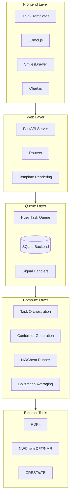
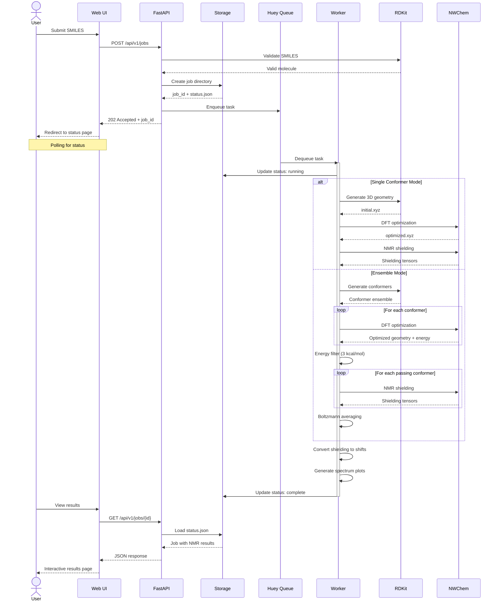
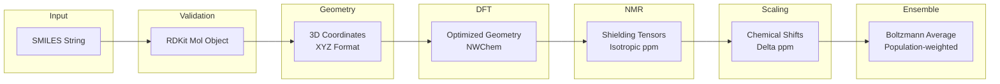
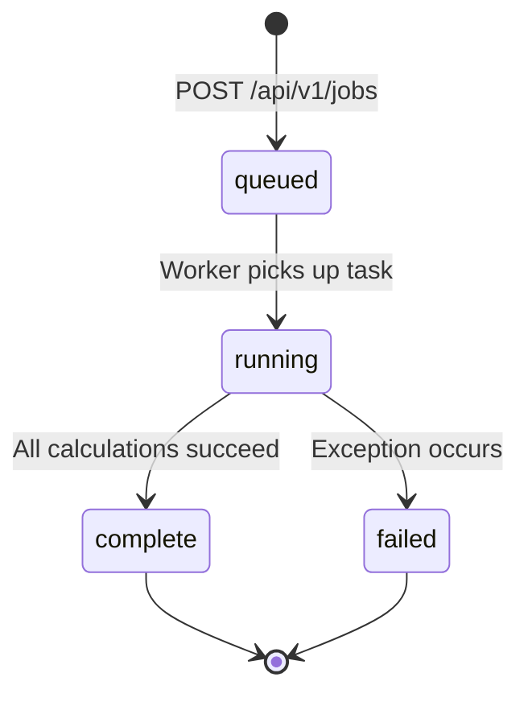
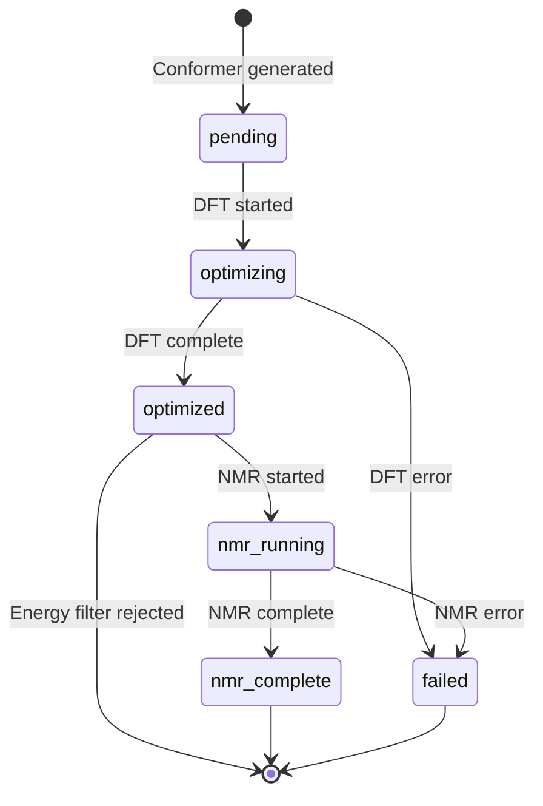

# Technical Architecture

This document describes the internal architecture of the QM NMR Calculator for developers and contributors. It covers the technology stack, data flows, job lifecycle, and file storage structure.

For a high-level overview, see the [Architecture section](../README.md#architecture-overview) in the main README.

**Audience:** Developers contributing to or extending the codebase.

---

## Technology Stack

The QM NMR Calculator is built on a Python-based async job processing architecture with quantum chemistry computation via NWChem.

### Stack Overview



### Component Table

| Component | Purpose | Key Files |
|-----------|---------|-----------|
| **FastAPI** | HTTP server, REST API, template rendering | `api/app.py`, `api/routers/` |
| **Huey** | Task queue with SQLite backend, signal-based status updates | `queue.py`, `tasks.py` |
| **NWChem** | DFT geometry optimization, GIAO NMR shielding, COSMO solvation | `nwchem/runner.py`, `nwchem/input.py` |
| **RDKit** | SMILES parsing, 3D embedding, conformer generation (ETKDGv3) | `conformers/rdkit_generator.py` |
| **CREST** | GFN2-xTB conformer search (optional, more thorough) | `conformers/crest_generator.py` |
| **Pydantic** | Input validation, job status models, serialization | `models.py` |
| **3Dmol.js** | Interactive 3D molecule viewer in browser | `templates/result.html` |
| **SmilesDrawer** | 2D structure preview on submission page | `templates/submit.html` |
| **Chart.js** | NMR spectrum visualization | `templates/result.html` |

### Technology Choices

**Why Huey over Celery?**
- Simpler setup with SQLite backend (no Redis/RabbitMQ required)
- Single-file database in `data/huey.db`
- Signal-based hooks for status updates (`SIGNAL_EXECUTING`, `SIGNAL_COMPLETE`, `SIGNAL_ERROR`)
- Sufficient for single-worker deployment typical of NMR calculations

**Why NWChem?**
- Open source quantum chemistry package
- GIAO method for NMR shielding calculations
- COSMO implicit solvation model
- MPI parallelization support
- Well-documented input file format

**Why RDKit for conformers?**
- Industry-standard cheminformatics toolkit
- Python bindings with active development
- ETKDGv3 distance geometry for 3D embedding
- MMFF force field for pre-optimization
- Handles SMILES, MOL, and SDF input formats

---

## Data Flow

### Request Flow

This sequence diagram shows the complete flow from job submission to result retrieval:



### Data Transformation Pipeline

Data transforms through multiple stages from input to final results:



**Stage Details:**

1. **SMILES to RDKit Mol**
   - Parse SMILES string with `Chem.MolFromSmiles()`
   - Add explicit hydrogens with `Chem.AddHs()`
   - Validate structure (returns None if invalid)

2. **RDKit Mol to 3D Coordinates**
   - Embed with ETKDGv3 distance geometry
   - Deterministic seed (0xF00D) for reproducibility
   - MMFF force field optimization

3. **3D Coordinates to Optimized Geometry**
   - NWChem B3LYP/6-31G* optimization
   - COSMO solvation model
   - Convergence criteria from preset

4. **Geometry to Shielding Tensors**
   - NWChem GIAO method
   - B3LYP with larger NMR basis (6-311+G(2d,p) for production)
   - COSMO solvation (same as optimization)

5. **Shielding to Chemical Shifts**
   - Linear scaling: shift = (intercept - shielding) / slope
   - Method/basis-specific regression factors
   - Separate parameters for 1H and 13C

6. **Shifts to Boltzmann Average** (ensemble mode)
   - Weight = exp(-E_rel / RT)
   - Normalize weights to sum to 1.0
   - Average: shift_avg = sum(weight_i * shift_i)

---

## Job Lifecycle States

Jobs transition through a defined set of states from submission to completion.

### State Machine



### State Descriptions

| State | Meaning | Triggered By | Key File |
|-------|---------|--------------|----------|
| `queued` | Job accepted, waiting for worker | `POST /api/v1/jobs` creates job directory | `storage.py:create_job_directory()` |
| `running` | Worker executing calculations | Huey `SIGNAL_EXECUTING` signal | `queue.py:on_task_start()` |
| `complete` | All calculations finished successfully | Huey `SIGNAL_COMPLETE` signal | `queue.py:on_task_complete()` |
| `failed` | Error during execution | Huey `SIGNAL_ERROR` signal | `queue.py:on_task_error()` |

### Step Progress Tracking

Within the `running` state, jobs track progress through calculation steps:

**Status Fields:**
- `current_step`: Active step identifier (e.g., `"geometry_optimization"`)
- `current_step_label`: Human-readable description (e.g., `"Optimizing geometry"`)
- `step_started_at`: When current step started
- `steps_completed`: Array of completed steps with timing

**Common Steps (Single Conformer):**

| Step ID | Label | Description |
|---------|-------|-------------|
| `geometry_optimization` | Optimizing geometry | NWChem DFT optimization |
| `nmr_shielding` | Computing NMR shielding | NWChem GIAO calculation |
| `post_processing` | Generating results | Shift conversion, plots |

**Common Steps (Ensemble Mode):**

| Step ID | Label | Description |
|---------|-------|-------------|
| `generating_conformers` | Generating conformers | RDKit or CREST ensemble |
| `optimizing_conformers` | Optimizing conformers (X/N) | DFT optimization loop |
| `computing_nmr` | Computing NMR (X/N) | NMR shielding loop |
| `averaging_shifts` | Computing Boltzmann average | Population weighting |
| `post_processing` | Generating results | Spectrum plots |

### Conformer States

Individual conformers in ensemble mode have their own state machine:



| State | Meaning |
|-------|---------|
| `pending` | Awaiting DFT optimization |
| `optimizing` | DFT optimization running |
| `optimized` | DFT complete, passed energy filter |
| `nmr_running` | NMR calculation running |
| `nmr_complete` | NMR complete, ready for averaging |
| `failed` | Error occurred during processing |

---

## File Storage Structure

Each job gets an isolated directory under `data/jobs/` with a deterministic structure.

### Directory Layout

```
data/jobs/{job_id}/
├── status.json                      # Job metadata and results
├── output/
│   ├── initial.xyz                  # RDKit 3D geometry (immediate)
│   ├── optimized.xyz                # DFT-optimized geometry
│   ├── nmr_results.json             # Chemical shifts (legacy format)
│   ├── spectrum_1H.svg              # 1H NMR spectrum plot
│   ├── spectrum_1H.png
│   ├── spectrum_13C.svg             # 13C NMR spectrum plot
│   ├── spectrum_13C.png
│   ├── structure_annotated.svg      # 2D structure with shift labels
│   ├── structure_annotated.png
│   ├── conformers/                  # Per-conformer outputs (ensemble)
│   │   └── {conf_id}/
│   │       └── geometry.xyz
│   └── optimized/                   # Optimized conformer geometries
│       └── {conf_id}.xyz
├── scratch/
│   ├── optimize.nw                  # NWChem optimization input
│   ├── optimize.out                 # NWChem optimization output
│   ├── shielding.nw                 # NMR calculation input
│   ├── shielding.out                # NMR calculation output
│   └── conformers/                  # Per-conformer scratch (ensemble)
│       └── {conf_id}/
│           ├── optimize.nw
│           ├── optimize.out
│           ├── shielding.nw
│           └── shielding.out
└── logs/
    └── *.log                        # NWChem process logs
```

### File Descriptions

**Root Files:**
- `status.json` - Complete job state including input parameters, status, timing, NMR results, and conformer ensemble data. This is the single source of truth for job state.

**Output Directory:**
- `initial.xyz` - RDKit-generated 3D geometry, created immediately for 3D preview before DFT completes
- `optimized.xyz` - DFT-optimized geometry (single mode) or lowest-energy conformer (ensemble)
- `nmr_results.json` - Chemical shifts in standalone JSON format (legacy, also in status.json)
- `spectrum_*.svg/png` - Publication-quality NMR spectrum plots
- `structure_annotated.*` - 2D structure with atom numbering and shift labels

**Scratch Directory:**
- `*.nw` - NWChem input files (useful for debugging or rerunning)
- `*.out` - NWChem output files (contains raw shielding tensors, energies)
- `conformers/{conf_id}/` - Isolated scratch per conformer

**Logs Directory:**
- Process output and error logs from NWChem execution

### Why Isolated Scratch Directories?

NWChem creates database files (`.db`, `.movecs`) during calculations. When running multiple conformers in parallel or sequentially:

**Problem:** Shared scratch directory causes file conflicts:
- `movecs` files overwritten between conformers
- Database corruption if multiple processes access same `.db`
- Unpredictable failures depending on timing

**Solution:** Each conformer gets isolated scratch:
```
scratch/conformers/conf_001/optimize.nw
scratch/conformers/conf_001/optimize.out
scratch/conformers/conf_002/optimize.nw
scratch/conformers/conf_002/optimize.out
```

This prevents conflicts and enables parallel execution.

### Storage Functions

Key functions in `storage.py`:

| Function | Purpose |
|----------|---------|
| `create_job_directory()` | Initialize job with status.json, output/, logs/ |
| `load_job_status()` | Load and parse status.json |
| `update_job_status()` | Update specific fields in status.json |
| `start_step()` | Track step progress with timing |
| `create_conformer_directories()` | Create isolated scratch/output per conformer |
| `get_conformer_scratch_dir()` | Get path to conformer scratch directory |

---

## Related Documentation

- [README](../README.md) - High-level overview and quick start
- [Installation Guide](installation.md) - System dependencies and setup
- [Usage Guide](usage.md) - Web UI and REST API reference
- [NMR Methodology](science.md) - DP4+, linear scaling, Boltzmann averaging
- [Library Documentation](libraries.md) - RDKit, NWChem, Huey integrations
